> [!important]  
> Атака As-rep Roasting позволяет злоумышленнику воспользоваться отключенной преаутентификацией Kerberos для пользователя с целью компрометации УЗ.  

# Теория

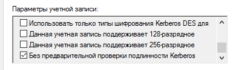

Когда Клиент приступает к проверке подлинности, на DC отправляется сообщение **AS**_**REQ** (Authentication Service Request). **AS**_**REQ**-сообщение **включает** **в** **себя** UPN (UserPrincipalName aka логин), имя службы, к которой идет обращение (**всегда krbtgt**), а также штамп времени, зашифрованный с использованием хэша пароля учетной записи пользователя.

Если пользователь имеет отключенную преаутентификацию, то AS_REQ будет **содержать всё, кроме зашифрованной метки времени (pA-ENC-TIMESTAMP).** Именно по этой причине, при проведении атаки можно вводить любой пароль- он не используется. DC не требует проверки подлинности временной метки. Вместо этого DC сразу же создаёт AS_REP и отправляет его клиенту.

  

По сути, при таком раскладе, схема аутентификации приобретает такой вид:  
  

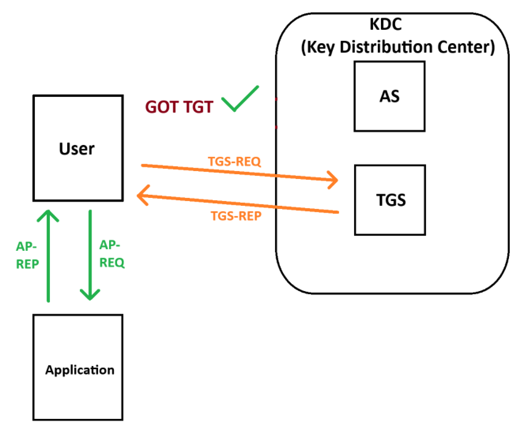

Это дает возможность получить TGT путем брутфорса содержимого AS_REP - сообщение **содержит** **в** **себе** билет TGT (Ticket Granting Ticket), зашифрованный с использованием хеша пароля учетной записи krbtgt, и сеансовый ключ, зашифрованный с использованием хеша пароля учетной записи пользователя.

Легитимный запрос AS_REQ и ответ SQ_REP:

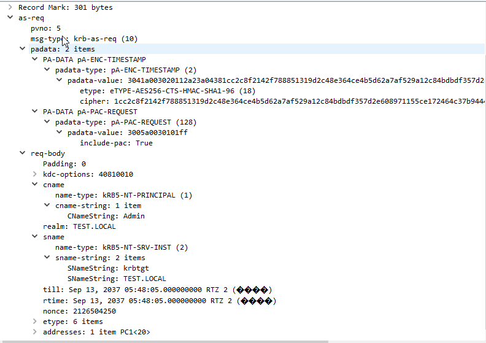

Запрос с использованием impacket-GetNPUsers:

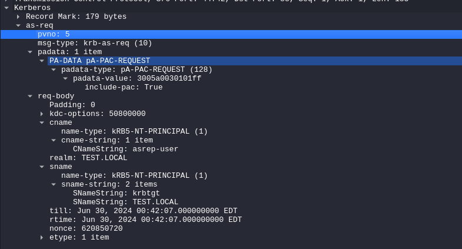

Как видно, **padata** содержит 1 элемент и не содержит в себе метку времени

  

_Вариант локальной разведки на наличие пользователей с выключенной преаутентификацией с использованием PoSH:_

`get-aduser -f * -pr DoesNotRequirePreAuth | where {$_.DoesNotRequirePreAuth -eq $TRUE}`   
  

# Практика

## Включенная преаутентификация

Попытка проведения атаки на аккаунт Admin, который имеет включенную преаутентификацию:

`impacket-GetNPUsers -request test.local/Admin -format john -outputfile hash.hash -dc-ip 192.168.1.1`

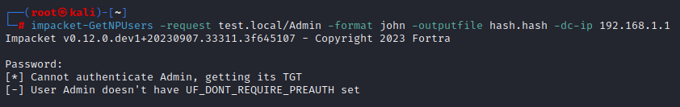

Как видно, возникает ошибка “UF_DONT_REQUIRE_PREAUTH”, которая говорит о включенной преаутентификации пользователя и, как следствие, ошибки проверки временной метки.

Так выглядит AS_REQ и AS_REP при проведении атаки:

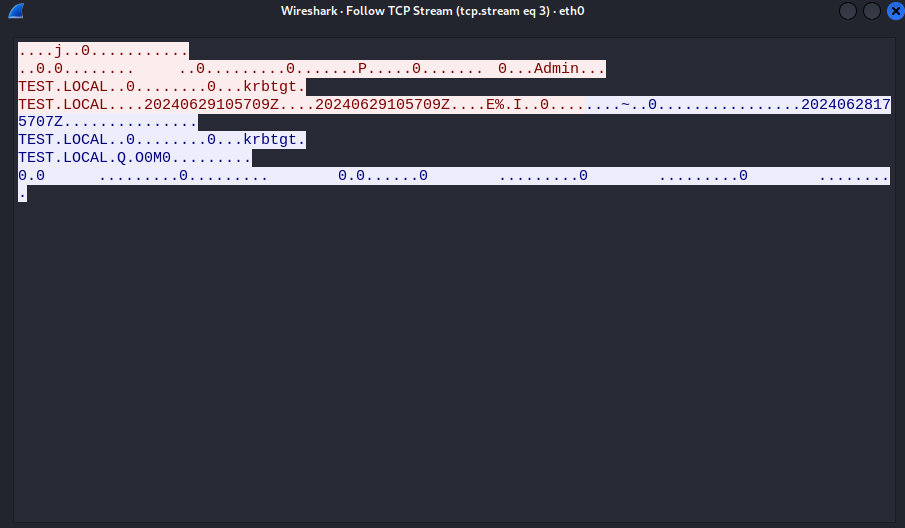

## Выключенная преаутентификация

Попытка проведения атаки на аккаунт asrep-user, который имеет выключенную преаутентификацию:

`impacket-GetNPUsers -request test.local/asrep-user -format john -outputfile hash.hash -dc-ip 192.168.1.1`

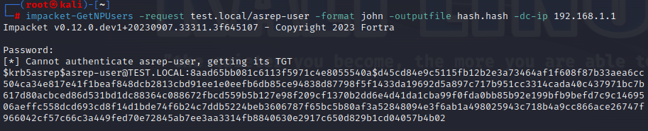

Как видно, KDC (AS) не стал проверять метку времени, вернув нам AS-REP и, фактически, билет TGT.

Так выглядит AS_REQ и AS_REP при проведении атаки:

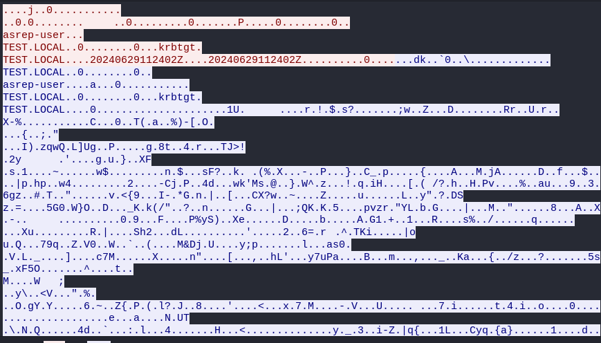

# Профит

Брутфорсим AS_REP, который представлен в виде хэша в формате john и получаем TGT

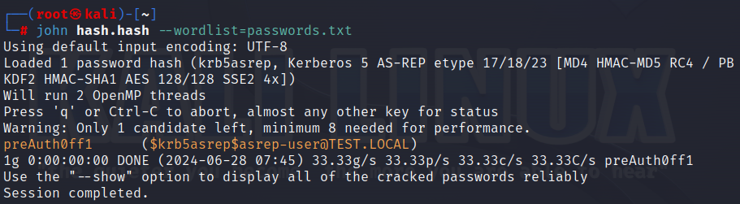

По факту, уже есть полностью скомпрометированная учетка.

Явно получаем TGT:

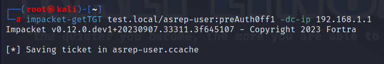

При получении TGT, можно заэкспорить билет в переменные окружения для последующей авторизации через Kerberos, используя сторонние утилиты.

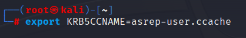

# Артефакты

При эксплуатации As-rep Roasting, порядок событий MSGID будет состоять из:

1. 4776 (Аудит отказа) - Компьютер пытался проверить учетные данные УЗ
2. 4625 (Аудит отказа) - УЗ не удалось выполнить вход в систему
3. 4768 (Аудит успеха) - Запрошен билет TGT (Тип шифрования билета: 0х17)
    - _==Тип шифрования 0x17 в контексте Kerberos, используемого в системах Windows для аутентификации, соответствует алгоритму шифрования RC4 с ключом HMAC.==_

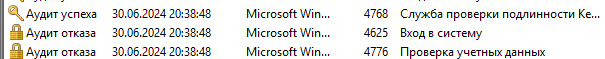