> [!important]  
> Атаки Diamond & Sapphire Ticket позволяют злоумышленнику изменять уже существующий легитимно выданный TGT билет. В случае с Diamond ticket, изменяется легитимный PAC для повышения привилегий или получения доступа. Для Sapphire ticket, легитимный PAC заменяется на PAC, полученный с помощью S4U2self+u2u. Данные техники являются скрытными и тяжелыми для обнаружения.
> 

# Теория

Прежде всего стоить понимать, что общая концепция атак строится на изменении PAC легитимно выданного TGT билета. 

*PAC (Privilege Attribute Certificate) — это структура данных, которая содержит информацию о пользователе (SID пользователя, группы, в которые входит пользователь, права доступа) и является частью TGT/TGS билетов.*

Дело в том, что злоупотребление доверием Kerberos (в частности, изменение PAC) в билете возможно потому, что многие службы проверяют PAC, не убеждаясь в его подлинности (даже на стороне KDC).

### Работа валидации PAC
**AS-REQ и AS-REP:**
- Клиент отправляет **AS-REQ** в Центр распределения ключей (KDC), чтобы запросить билет для выдачи билета (TGT).
- KDC выдаёт TGT в **AS-REP**, встраивая PAC в зашифрованную часть билета.

**TGS-REQ и TGS-REP:**
- Клиент отправляет **TGS-REQ в KDC**, используя TGT для запроса сервисного билета для конкретного ресурса.
- KDC отвечает с помощью **TGS-REP**, который включает PAC.

**AP-REQ:**
- Клиент отправляет **TGS** (включая PAC) целевому сервису.

**Проверка PAC службой:**
- Если служба доверяет KDC, она может напрямую использовать PAC без проверки.
- Если сервису требуется проверка PAC, он отправляет PAC на контроллер домена (DC) для проверки.

**Сведения о проверке PAC:**
- Служба отправляет PAC в DC с использованием проверки подписи Kerberos.
- DC проверяет цифровую подпись PAC (созданную с использованием закрытого ключа KDC) для обеспечения целостности и подлинности.
- Если это действительно так, администратор возвращает подтверждение службе.

**AP-REP:**
- После проверки PAC сервис предоставляет или отказывает в доступе в зависимости от прав пользователя.

Рассмотрим каждую атаку подробнее.
## Diamond Ticket
По своей сути, Diamond Ticket — это TGT, который:
1. Расшифрован с помощью секретов сервисной учетной записи krbtgt.
2. Подвергнут изменениям в PAC (например, повышение привилегий путем добавления членства в группу "Администраторы домена").
3. Зашифрован с помощью секретов сервисной учетной записи krbtgt.

Поскольку PAC формируется на этапе получения TGT, то за TGS переживать не стоит: он не хранит PAC напрямую, а использует его из TGT, чтобы проверить пользователя и его права. 

Однако, стоит учитывать, что есть некоторая вероятность обнаружения сервисами неладного. Например, если пользователь присвоил себе членство в той или иной группе, на деле членом которой он не является, служба или KDC может проверить PAC и отклонить билет по причине несоответствия информации в билете и реальными данными о пользователе в AD. В аналогию можно привести случай, когда мы выпускаем билет TGT (атака [Golden Ticket](https://habr.com/ru/articles/836818/)) для несуществующего пользователя — он просто не будет работать.

**Что требуется для Diamond Ticket:**
1. NT-хэш учётной записи krbtgt/целевого сервиса.
2. Ключ AES256 учетной записи krbtgt/целевого сервиса (для изменения PAC).
3. Название домена.
4. SID домена и пользователя.
5. Логин и пароль для УЗ, для которой выпускаем билет.
6. SPN службы, к которой мы хотим получить доступ.
## Sapphire Ticket
~~Вы когда-нибудь мечтали стать лучшей версией себя? Моложе, красивее, идеальнее?~~

Sapphire Ticket — это улучшенная версия Diamond Ticket, которая заключается в более скрытном и "легитимном" с точки зрения "подлинности билета" подходе.

Как я писал выше, сервис или KDC может проверить, что информация о пользователе в билете и данные из Active Directory могут различаться. Чтобы обойти этот нюанс, злоумышленники не просто заново шифруют PAC для пользователя с измененными полномочиями, а используют для этого реального пользователя с необходимыми правами. Это возможно благодаря S4U2self+u2u. Иными словами, обманываем эту гребаную ракетку.

А теперь немножко по определениям:

*S4U2self (Service for User to Self) — это механизм, который позволяет сервису получить служебный билет от имени другого пользователя (принципала) для себя.*
*u2u (user to user) — это разновидность обычного запроса сервисного билета, которая позволяет пользователям размещать защищенные сервисы приложений на своих хостах. В протоколе «пользователь-пользователь» один пользователь выступает в роли сервера, а другой — в роли клиента.*

Таким образом, при использовании S4U2self и u2u вместе, флаги и структуры, которые оба механизма включают в свои запросы, объединяются. Но как это работает в контексте атаки?

**Общая концепция атаки:**
1. Запрашиваем билет S4U2Self с помощью u2u без SPN от имени пользователя с повышенными правами (например, для администратора домена).
2. Получаем ST (как если бы пользователь прошёл аутентификацию по отношению к нам).
3. Из п.2 имеем PAC.
4. Расшифровываем PAC с помощью ключей krbtgt.
5. Изменяем PAC для текущего TGT.
6. Шифруем PAC с помощью ключей krbtgt.
7. Применяем билет.

[Подробнее о S4U2self и u2u ](https://www.thehacker.recipes/ad/movement/kerberos/#s4u2self-+-u2u)

**Для Sapphire Ticket потребуется:**
1. NT-хэш учётной записи krbtgt/целевого сервиса.
2. Ключ AES256 учетной записи krbtgt/целевого сервиса (для изменения PAC).
3. Название домена.
4. SID домена и пользователя.
5. Логин и пароль для УЗ, для которой выпускаем билет.
6. SPN службы, к которой мы хотим получить доступ.
7. Имя УЗ с повышенными правами.

# Практика
Атаки буду проводить для обычного пользователя ticket_user, членство в группах которого ограничивается "Пользователи домена".
## Diamond Ticket
#### Удаленный вектор
По-старинке, используем impacket. В нем есть замечательная тулза под названием ticketer:

``` shell
impacket-ticketer -request -domain 'domain' -user 'user' -password 'password' -nthash 'krbtgt/service nthash' -aesKey 'krbtgt/service aesKey' -domain-sid 'domain-sid'  -groups 'optional' user
```

*где `user` указывает на SPN или имя пользователя, за которое выдает себя злоумышленник, подделывая доступ aka для кого будет выпущен билет*.

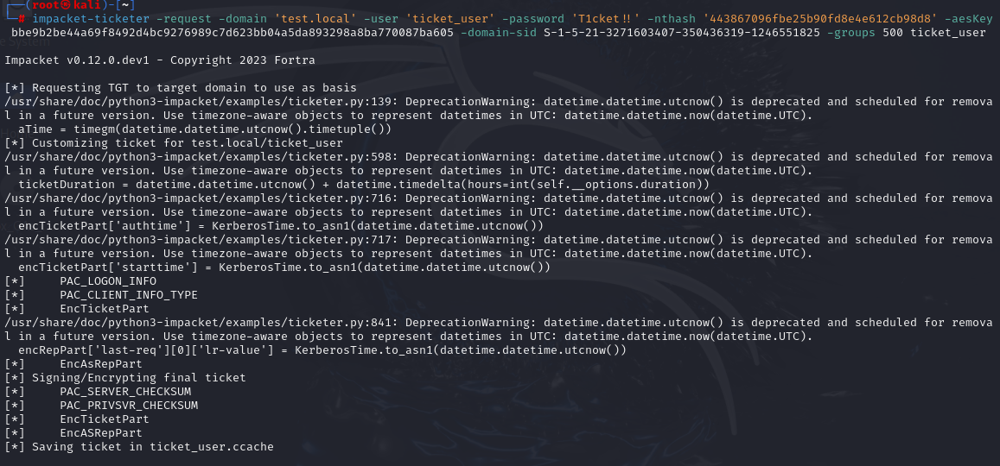

Выполняем экспорт билета для последующей атаки PassTheTicket:

```shell
export KRB5CCNAME=ticket.ccache
```

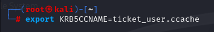

С помощью psexec из того же набора impacket проверим работоспособность выпущенного билета:

```shell
impacket-psexec 'domain/user@host.domain' -dc-ip ip -k -no-pass
```

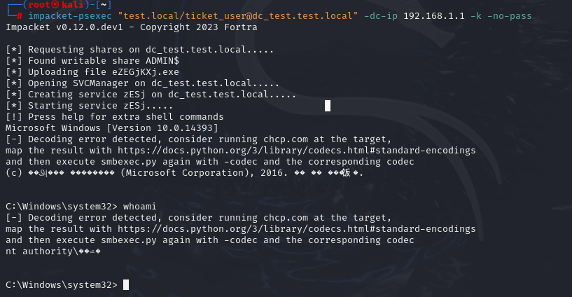

Таким образом, нам удалось изменить существующий "легитимно выданный" KDC билет для пользователя ticket_user и присвоить ему членство в группе Администраторов.
#### Локальный вектор
Атаку возможно также проэксплуатировать локально с использованием Rubeus:

``` c
rubeus.exe diamond /krbkey:aesKey /user:user /password:password /enctype:aes /domain:domain /dc:dc-fqdn /ticketuser:user /ptt /nowrap
```


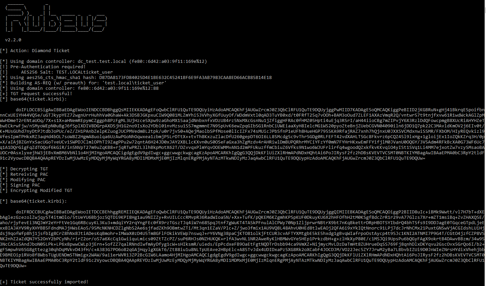
## Sapphire Ticket
На данный момент злодействовать можно только с помощью ticketer из набора impacket версии >= 0.10.0.
Общий синтаксис команды имеет следующий вид:

```shell
impacket-ticketer -request -impersonate 'admin_acc' -domain 'domain' -user 'user' -password 'password' -nthash 'krbgtg_nthash' -aesKey 'krbtgt-aesKey' -domain-sid 'domain-sid' ticket_name
```

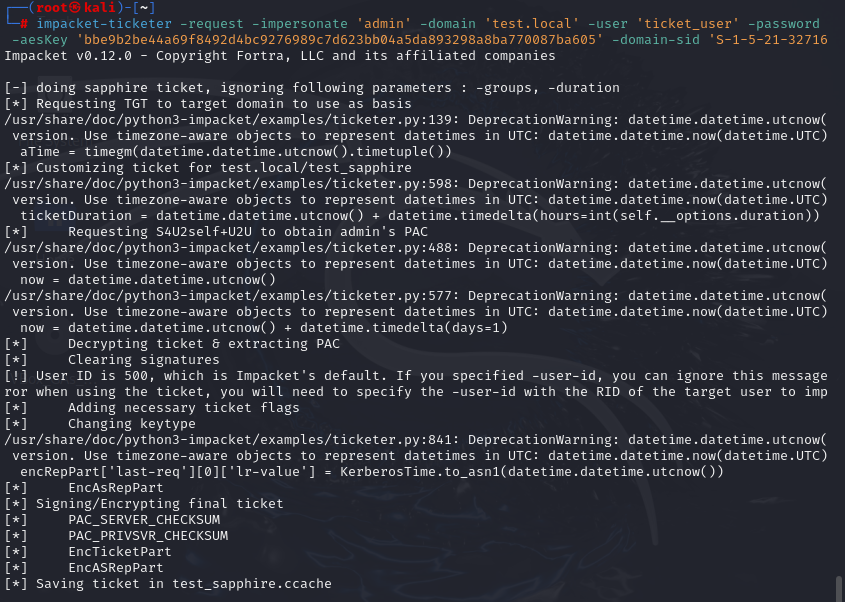

Между тем, рассмотрим трафик общения с KDC на этапе получения билета. Напомню, что TGT билет запрашивался для пользователя ticket_user:

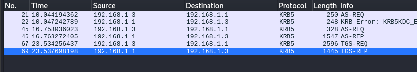

AS-REQ и AS-REP мы пропустим, поскольку в них нет никакой интересующей нас информации.

**TGS-REQ:**


Здесь стоит обратить внимание на блок PA-DATA pA-FOR-USER. Это ничто иное, как S4U2Self. Как видим, обращение к выпуску билета идет к пользователю admin (это наш impersonate).

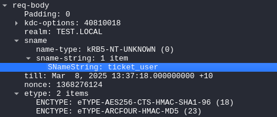

Также важным является блок req-body, который говорит нам, что это u2u, содержащий легитимного пользователя, который запрашивал TGT у KDC.
Итого, получается, что мы запросили билет S4U2Self с помощью u2u без SPN от имени пользователя с повышенными правами и, в следствии, получили ST.

**TGS-REP:**


Ответ от KDC содержит в себе 2 важных для рассмотрения бока: cname и ticket. 
cname содержит в себе легитимную информацию о пользователе (CnameString), который хочет запросить доступ к сервису (SNameString в блоке ticket).

Для наглядности, проверим содержание выпущенного билета: 

```shell
python3 --aes 'aes-key' ticket.ccache
```

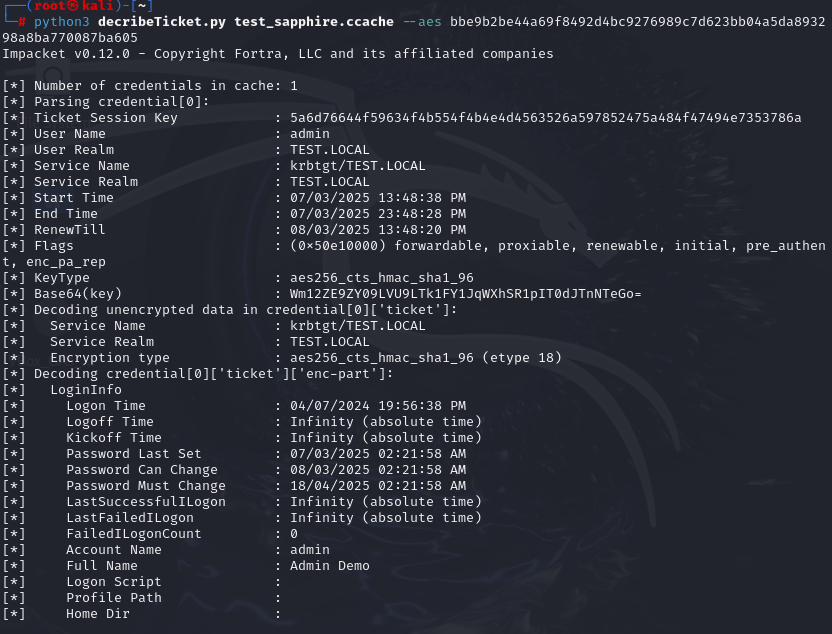
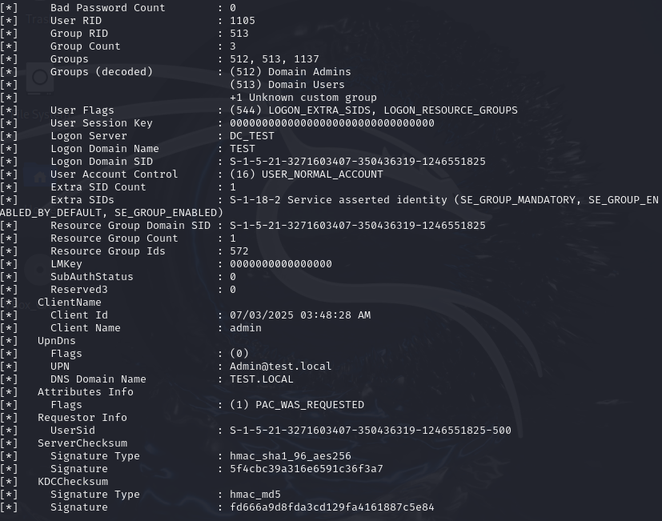

Хорошо видно, что билет содержит в себе информацию о привилегированной УЗ admin, но не содержит никакой информации об изначальной УЗ user_ticket. Это говорит нам о том, что PAC, действительно, был подписан с помощью нужной УЗ.

Попробуем протестировать билет:

```shell
export KRB5CCNAME=ticket.ccache

impacket-psexec 'domain/impersonate-user@fqdn' -k -no-pass
```


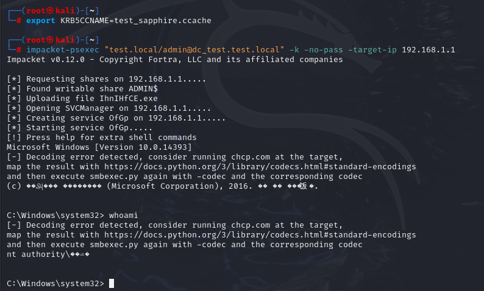

# Артефакты
Нам уже известно, что обе техники используют обращение к KDC c целью получения TGT для дальнейших манипуляций с ним и, как следствие, запроса TGS. 
## Diamond Ticket
Но как выглядят события 4768 (запрос TGT) и 4769 (Запрос TGS) и можно ли как-то обнаружить атаку по их содержанию?

**MSGID 4768:**

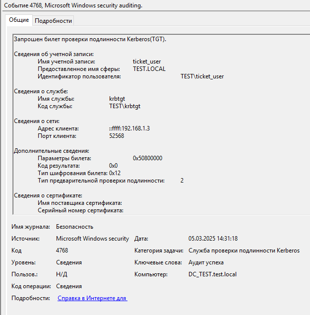
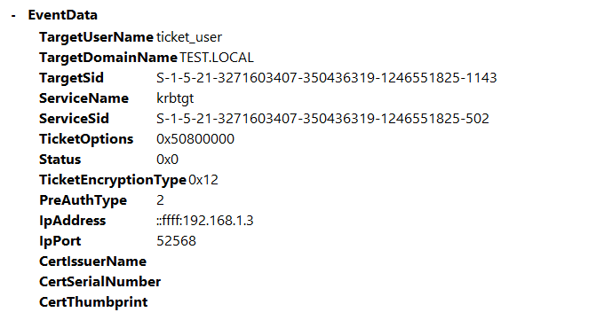

**MSGID 4769:**

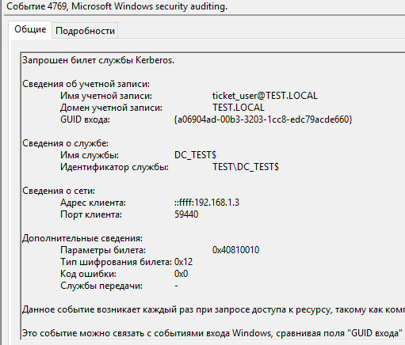
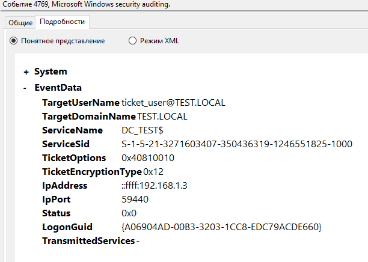

Заметим, что события абсолютно нормальные и в них ничего подозрительного нет, за исключением адреса недоменной машины.
Вспомним, что конечным событием после получения TGS является MSGID 4624 (пользователь вошел в систему). 

**MSGID 4624:**

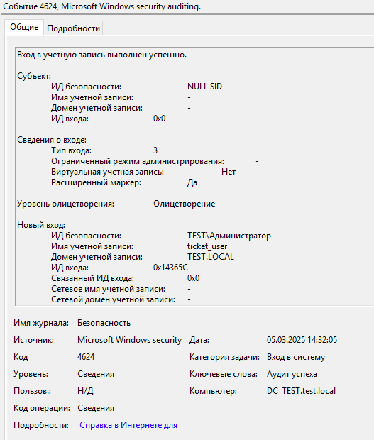
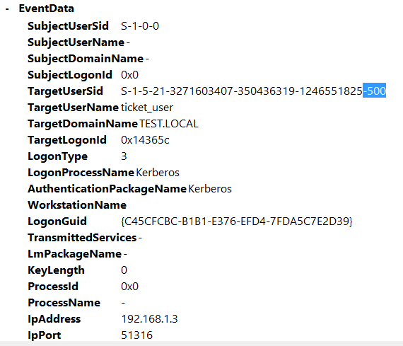

На данном этапе, картина становится предельно ясна: SID пользователя (-1143) не соответствует SID пользователя в событии входа (-500) и, как следствие, ИД безопасности пользователя = Администратор, что говорит об успешном повышении привилегий.
## Sapphire Ticket
### Этап получения билета
Sapphire Ticket не только вызывает событие 4768 (Запрос TGT), но также и событие 4769 (Запрос TGS).

**MSGID 4768:**

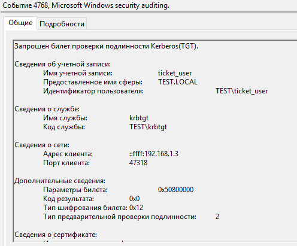

**MSGID 4769:**

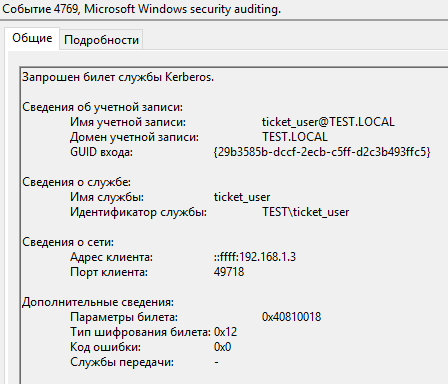

При расследовании, стоит обратить внимание на факт обращение к службе, которая равна субъекту по отношению к запросу билета (запрашивает сам себя в качестве службы). Такая аномалия возникает из-за использования S4U2Self
### Этап эксплуатации билета
При проведении атаки Pass-The-Ticket, генерируются 2 события: 4769 (Запрос TGS) и 4624 (Вход в систему):

**MSGID 4769:**

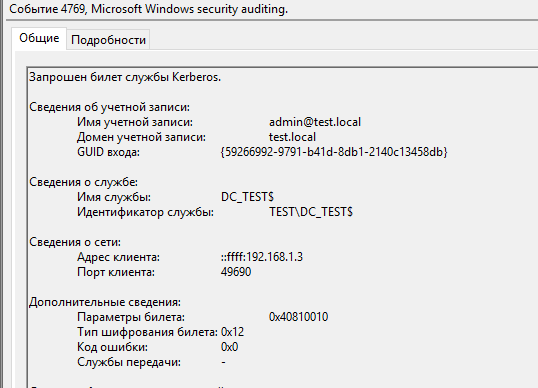

В целом, в этом событии особенного нет. Однако, ключевым моментом является отсутствие запроса TGT (MSGID 4768) для данного пользователя и обращение к службе, которая является УЗ хоста.

**MSGID 4624:**

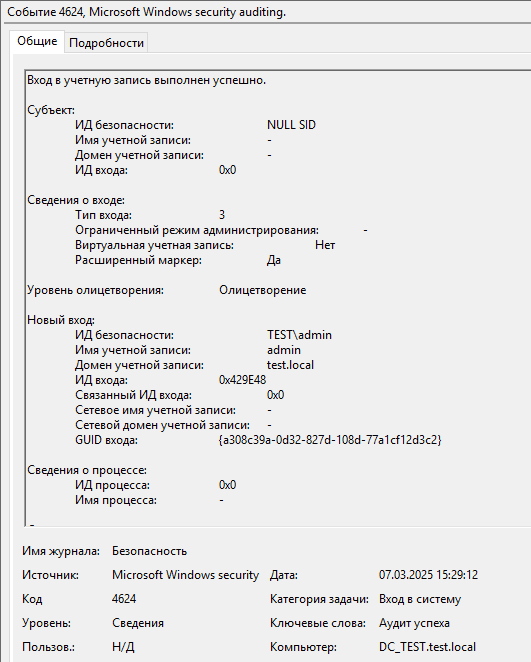

Здесь стоит обратить внимание на неопределенность субъекта и, одновременно с этим,   олицетворение для УЗ с повышенными правами.

По своей сути, конечные артефакты данной техники совпадают с Golden Ticket.

###  **Сводная таблица: Diamond vs Sapphire**

| **Критерий**        | Diamond Ticket 🎫      | Sapphire Ticket 💎    |
| ------------------- | ---------------------- | --------------------- |
| Нужен ли TGT?       | ✅                      | ✅                     |
| Обнаружение в 4768  | ❌                      | ❌                     |
| Риск для атакующего | Высокий (SID mismatch) | Низкий (реальный PAC) |
| Сложность для Blue  | Средняя                | Высокая               |
# Детекторы за 5 минут
Поискав на просторах необъятного интернета готовые способы детектирования атак, я ничего не нашел, погрустил и пошел писать свои 2 sigma-правила для детекта данных техник.

[Подробнее о правилах sigma](https://github.com/SigmaHQ/sigma)
## Diamond Ticket

```yaml
title: Detecting Potential Diamond Ticket Attack
id: ddbd411e-3e34-4121-a6c2-5873db4ca696
status: experimental
description: Правило позволяет обнаружить потенциальное выполнение атаки Diamond Ticket
references: 
  - https://github.com/artroneee/Cyber-Security-Collection/blob/main/Cyber%20Security%20Collection/Windows/Active%20Directory/Diamond%20%26%20Sapphire%20Tickets.md
tags:
  - attack.t1558
author: artrone
date: 2025-03-12
logsource:
  product: windows
  service: security
detection:
  event_1:
    EventID: 4624
  artefacts_1:
    SubjectUserSid: 'S-1-0-0'
    TargetUserSid|endswith: 
      - '-500'
  event_2:
    EventID: 4769
  artefacts_2:
    ServiceName|endswith: '$'
    TicketEncryptionType: '0x12'
  filter:
    - TargetUserID: 'S-1-5-18'
    - TargetUserName|endswith: '$'
condition: ((event_1 and artefacts_1) or (event_2 and artefacts_2)) and not filter
fields:
  - TargetUserSid
  - ServiceName
falsepositives:
  - legitimate windows processes (need white/black lists)
level: high
```
		 
Правило работает по нескольким паттернам:
1. При событии 4624: Если субъект не определен, а в качестве олицетворения входит пользователь, чей SID заканчивается на -500 (стандартное значение, которое автоматически устанавливается impacket-ticketer).
2. При событии 4769: Если имя запрашиваемого сервиса заканчивается на "$" (УЗ хоста) и тип шифрования 0х12.
3. Исключения: Если вход выполняется системой/УЗ-службы при SubjectUserSid = S-1-0-0.
## Sapphire Ticket
```yaml
title: Detecting Potential Sapphire Ticket Attack
id: 3d478918-0183-45b0-92e3-04222b79791b
status: experimental
description: Правило позволяет обнаружить потенциальное выполнение атаки Sapphire Ticket
references: 
  - https://github.com/artroneee/Cyber-Security-Collection/blob/main/Cyber%20Security%20Collection/Windows/Active%20Directory/Diamond%20%26%20Sapphire%20Tickets.md
tags:
  - attack.t1558
author: artrone
date: 2025-03-12
logsource:
  product: windows
  service: security
detection:
  event:
    EventID: 4769
  artefacts:
    TargetUserName|re: '(?i)^(.*)@.*$'
    ServiceName: \\1    # захватим группу с совпадением
    TicketEncryptionType: '0x12'
condition: event and artefacts
fields:
  - ServiceName
  - TargetUserName
falsepositives:
  - pentest
level: high
```
Правило работает по следующему паттерну:
* Если имя УЗ совпадает с именем сервиса и тип шифрования 0х12, происходит алерт.

