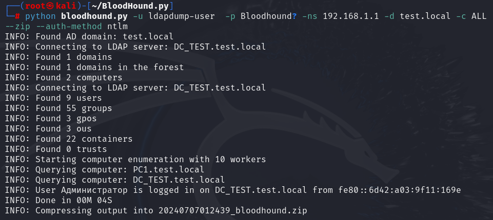

> [!important]  
> Атака Domain Dump позволяет злоумышленнику сдампить домен для получения информации о пользователях и группах, а также для последующего построения пути компрометации домена.  

# Теория

_*данная статья будет рассмотрена на примере утилиты bloodhound_ *

Стадии работы на примере **bloodhound:**

1. Аутентификация через указанный протокол
2. Сбор информации о количестве лесов, доменов и хостов
3. Сбор информации о пользователях, группах, политиках и т.д.
4. Попытки обращений к компьютерам домена
5. Проверка активных пользователей

  

Процесс удаленного дампа может быть осуществлен с помощью Kerberos или NTLM аутентификации. В случае, если был выбран Kerberos и произошла ошибка получения TGT, метод аутентификации будет автоматически изменен на NTLM.

  

Трафик проведенной атаки выглядит следующим образом:

Таким образом, от сервера нам прилетает вся информация, в данном случае, о пользователе “Администратор”, которая представлена в виде обычного текста и HEX формата.

# Практика

## Дамп через Kerberos аутентификацию

`python bloodhound.py -u ldapdump-user -p Bloodhound? -ns 192.168.1.1 -d test.local -c ALL --zip --auth-method kerberos -k`

Как видно, 2 строка вывода программы проинформировала нас о получении TGT, что свидетельствует о том, что аутентификация через Kerberos была успешно выполнена.

### Трафик атаки

Как обычно, начинаем с Kerberos аутентификации. Поскольку дальше идет работа с LDAP, то и в TGS_REQ SNameString будет содержать ldap

После этого, идет аналогичный запрос TGS_REQ, но уже для обращения к SMB - SNameString: cifs

## Дамп через NTLM аутентификацию

`python bloodhound.py -u ldapdump-user -p Bloodhound? -ns 192.168.1.1 -d test.local -c ALL --zip --auth-method ntlm`

### Трафик атаки

Сначала идет NTLM аутентификация, сразу после которой идут LDAP запросы.

Осуществление еще одной NTLM аутентификации для взаимодействия с SMB.

## **Локальный дамп**

Также, если есть необходимость выявить всех пользователей домена и информацию о них, можно выполнить локальный дамп с помощью PoSH  
  
`Get-ADUser -Filter * -Properties DisplayName, EmailAddress, Enabled, LastLogonDate | Format-Table -AutoSize`

# Артефакты

Как правило, при проведении данной атаки, основным фактором является наличие множества событий MSGID 1644 (Выполнен LDAP запрос), а также MSGID 2889 (Незащищенные привязки LDAP), которые подкрепляются событиями из разделов ниже

## Дамп через Kerberos аутентификацию

## Дамп через NTLM аутентификацию

# Вывод

Как видно, основной последовательностью событий в журнале безопасности Windows при разных протоколах аутентификации служат:

1. Вход в систему (как правило, несколько раз подряд)
2. Обращения к службам:
    1. Для Kerberos в TGS_REQ: ldap и cifs в SNameString
    2. Для NTLM: ldap и smb
3. Обращения к шаре \\*\IPC$ с маской 0x1 (чтение данных или перечисление каталогов)
4. Выход из системы (количество эквивалентно входам)

# Профит

Получаем визуализацию полученных данных и ищем доступные пути компрометации домена

