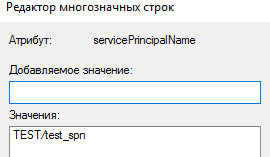
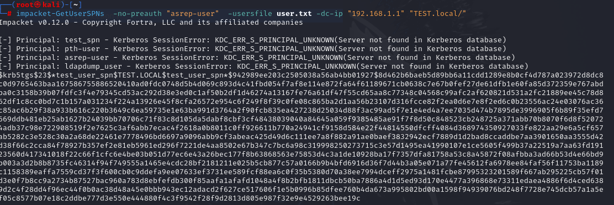
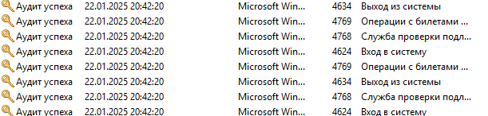
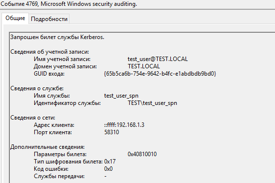

> [!important]  
> Атака Kerberoasting позволяет злоумышленнику захватить сервисную УЗ путём запроса TGS с указанием имени этой сервисной УЗ и последующим брутфорсом билета.

# Теория

Немного рассмотрим атаку под капотом. Как мы знаем, алгоритм аутентификации пользователя в контексте Kerberos строится следующим образом:

Если AS-REQ для получения TGT состоит из связки
`UPN (User Principal Name) + SN (Service Name) + Timestamp, зашифрованный хэшем пароля пользователя`
то TGS-REQ имеет следующую картину:
`SPN (Service Principal Name) + (UPN (User Principal Name) + Timestamp) + TGT`
Ответ от KDC, именуемый TGS-REP представляет из себя билет, который зашифрован хэшем пароля сервисной УЗ, имя которой фигурировало в запросе этого билета.
В общем случае, Kerberoasting схож с атакой AS-Rep Roasting, но, грубо говоря, сдвинут на шаг вперед в контексте аутентификации Kerberos.

Таким образом, становится очевидно, что для проведения атаки необходим доступ до любой доменной УЗ. Однако, это не всегда так, но к этому мы вернемся немного позже.

В основном, атака состоит из следующих шагов:
1. Поиск SPN's
2. Запрос(ы) Service Ticket's, адресат которых будет содержать имя сервисной УЗ по найденному SPN
3. Брутфорс тикета
4. Компрометация сервисной УЗ
## Поиск SPN's

Подобную активность можно воссоздать, используя и Kerberos, и NTLM, поскольку при поиске данной информации происходит взаимодействие с LDAP.

Трафик активности выглядит следующим образом:
### Kerberos

### NTLM

В принципе, ничего сверхъестественного. Однако, стоит обратить внимание на содержание запроса и ответа LDAP:
Запрос:

Видно, что мы делаем выборку по УЗ, у которых в атрибутах установлен параметр servicePrincipalName. Выглядит это так:

Ответ:

LDAP отдал интересующую нас информацию и сетевое взаимодействие прекратилось.

## Запрос TGS

Рассмотрим сетевую активность при попытке запроса TGS, используя найденную УЗ с SPN
TGS-REQ:

Как видно, KDC успешно отдал нам TGS (TGS-REP), SNameString которого содержит в себе имя сервисной УЗ, у которой есть SPN , что говорит об успешной аутентификации на нашем "сервисе".
## Kerberoasting без наличия доменного аккаунта

Как я говорил выше, нам необязательно иметь доступ к доменной УЗ для атаки. Давайте рассмотрим почему это так.

Из статьи про [AS-REP Roasting](As-Rep%20Roasting.md) мы знаем, что если у пользователя отключена преаутентификация Kerberos, то KDC не проверяет пароль (если точнее, то зашифрованную метку времени (pA-ENC-TIMESTAMP) хэшем пароля пользователя - её попросту нет в AS-REQ). Именно поэтому, мы получаем AS-REP, который, по своей сути, является зашифрованным TGT. А если мы имеем TGT, то и можем запросить TGS.
Однако, стоит учесть, что явно TGS мы не получаем. В данном случае, мы даже не отправляем KDC запрос TGS-REQ и, соответственно, не получаем TGS-REP- всё ограничивается запросом TGT.

### Разбор трафика:
Ниже приведен пример выполнения атаки, нацеленной на целый скоуп пользователей

Видно, что в трафике отсутствует хотя бы 1 запрос на получение TGS. 
Давайте заглянем в тело одного из AS-REQ:

Интересным моментом является значение атрибута SNameString. Напомню, что по стандарту блок sname-string содержит в себе 2 элемента: `SNameString: krbtgt` и `SNameString: <домен>`
# Практика
Рассмотрим 2 сценария выполнения атаки:
1. Kerberoasting
2. Kerberoasting без наличия доступа к УЗ доменного пользователя
## Kerberoasting
*При проведении атаки, обычно пользуются скриптом GetUsersSPNs из набора Impacket для удаленного проведения атаки и Rubeus для локального*.
`impacket-GetUsersSPNs 'test.local/test_user:P@ssword!' -dc-host "DC_TEST.test.local" -request`

Выполнив команду, мы сначала сделали запрос к LDAP, найдя всех пользователей с SPN, а затем запросили TGS билет, указав в качестве службы найденную УЗ "test_user_spn".

Теперь необходимо завернуть вывод команды в файл и забрутить пароль:
`echo 'string' > file.hash`
`john file.hash --wordlist=passwords.txt`

В конечном счете, мы получили пароль от УЗ test_user_spn, тем самым скомпрометировав её.

#### Вариант локальной атаки, используя Rubeus
`Rubeus.exe kerberoast /outfile:kerb_tgs.txt /domain:"TEST.LOCAL" /dc:"DC_TEST.TEST.LOCAL" /user:"test_user" /password:"P@ssword!" /spn:"test_user_spn"`

## Kerberoasting без наличия доступа к УЗ доменного пользователя

Как я и говорил выше, мы можем злоупотребить отключенной преаутентификацией пользователя для запроса TGS, не имея в своём арсенале доступа к какому-либо аккаунту. Делается это следующей командой:
`impacket-GetUsersSPNs -no-preauth "asrep-user" -usersfile user.txt -dc-ip "192.168.1.1" "TEST.local"/`
Здесь мы явно перебираем доменные УЗ, которые хранятся в файле user.txt. 

Повторяем процедуру с брутфорсом и радуемся, если пароль не слишком сильный :)

#### Локальный вариант проведения атаки, используя Rubeus
`Rubeus.exe kerberoast /outfile:file.txt /domain:"TEST.LOCAL" /dc:"DC_TEST.TEST.LOCAL" /nopreauth:"test_user" /spn:"test_user_spn"`

Таким образом, выполнив команду из-под УЗ pth-user, мы запросили билет от имени пользователя test_user, имя службы в билете которой является УЗ-сервисом test_user_spn.

# Артефакты
При проведении данной атаки при разных сценариях, артефакты можно разделить на 2 категории:
1. С событием 4769 (Обычный Kerberoasting)
2. Без события 4769 (Kerberoasting без наличия доступа к УЗ доменного пользователя)
## С событием 4769
При реализации сценария с базовой атакой, последовательность событий выглядит примерно следующим образом:
Поиск SPN's, используя NTLM:

Поиск SPN's, используя Kerberos:

В обоих случаях, в событии 4769 мы видим нетипичное обращение на запрос билета, в котором Service Name представляет собой запрос к УЗ-службе.

## Без события 4769 
А таким образом выглядят события атаки, проведенной с помощью УЗ без предварительной аутентификации:

Поскольку мы точно не знаем, какие из пользователей имеют SPN, то мы просто перебираем их, генерируя множественные события 4768. Как только мы находим такую УЗ, получаем статус успеха для данного события. Обратить внимание, по-прежнему, стоит на Service Name:

По умолчанию, здесь должен быть krbtgt.
Таким образом, при реализации данного сценария, мы можем говорить, что запрос TGT эквивалентен запросу TGS.

*Помимо всего прочего, немаловажным признаком из событий выше является тип шифрования билета 0х17, код которого относится к RC4.*

