> [!important]  
> Атака Silver Ticket позволяет злоумышленнику выпускать и использовать поддельные TGS (Ticket Granting Service) билеты для разных служб. В отличие от Golden Ticket, который требует взаимодействия с KDC, Silver Ticket никак с ним не контактирует, что делает эту атаку более незаметной для обнаружения. 

# Теория

Прежде всего, начать стоит со схемы процесса аутентификации Kerberos.
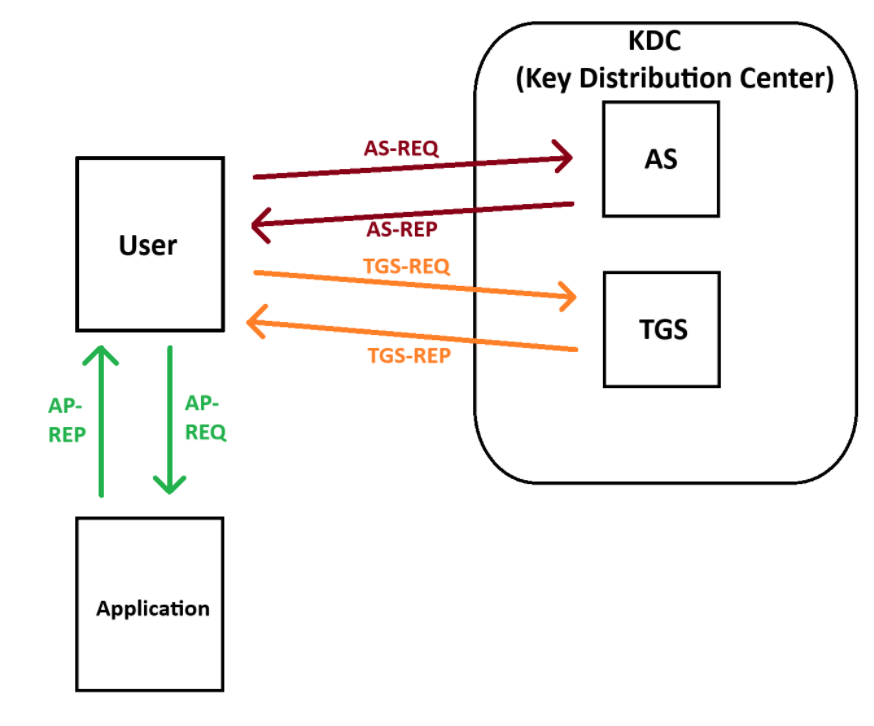

Известно, что при легитимной аутентификации сначала идет процесс получения TGT - обращение к AS (Authentication Server), а затем к TGS (Ticket Granting Service). В первом случае происходит обращение к krbtgt, а во втором мы запрашиваем сервис.

Но почему же мы абузим обращения к KDC?
Дело в том, что при атаке Silver Ticket, KDC не будет участвовать в процессе аутентификации, поскольку при выпуске поддельного TGS билета мы можем напрямую обращаться к целевому сервису. Это возможно потому, что сервис проверяет билет, используя свой ключ, и, если билет подписан корректно, предоставляет доступ. В общем случае, для TGS-REP это выглядит так:
	Часть, зашифрованная сессионным ключом TGT (TGT Session Key):
		- Содержит сессионный ключ для сервиса (Service Session Key).
		- Эта часть может быть расшифрована только пользователем, так как он знает сессионный ключ TGT.
	Часть, зашифрованная ключом сервиса (Service Key):
		- Содержит TGS-билет.
		- Эта часть может быть расшифрована только целевым сервисом, так как только он знает свой ключ сервиса.

Таким образом, при прямом обращении к сервису, мы исключаем посредника (KDC/TSG).

Последовательность атаки состоит из 3-х шагов:
1. Компрометация NT хэша службы
2. Выпуск билета
3. Применение билета (Pass The Ticket)

На шаге 1 и 3 останавливаться не имеет смысла, поскольку в контексте разбора они не очень нам интересны.
## Выпуск билета

Service Ticket, выпущенный злоумышленником, можно представить в упрощенном виде:
- **область** : test.local
- **имя пользователя**: *service*\host.domain
- **enc-part** : _# Зашифровано скомпрометированным NT(AES)-хэшем службы_
    - **ключ**: 0xXXXXXXXXXXXXXXX _# произвольный ключ сеанса_
    - **crealm** : domain *# домен в формате test.local*
    - **cname** : User *# имя пользователя*
    - **время выдачи** : 2050/01/01 00:00:00 _# Дата окончания действия билета_
    - **данные авторизации**: _#поддельный PAC, в котором пользователь имеет требуемые привилегии_

Что мы в итоге имеем?
1. enc-part будет зашифрована с помощью NT (AES) хэша службы, который у нас имеется
2. На основе зашифрованного enc-part создаем KRB_AP_REQ
3. Отправляем этот билет службе вместе с аутентификатором, который он зашифрует с помощью сеансового ключа
4. Служба расшифрует TGS, извлечет сеансовый ключ, расшифрует аутентификатор и предоставит доступ

В результате, PAC (Privilege Attribute Certificate) защищён двумя подписями:
1. **Подпись службы** — проверяется службой всегда.
2. **Подпись контроллера домена (krbtgt)** —  службы с высокими привилегиями (например, SYSTEM) и с SeTcbPrivilege часто не проверяют.

*SeTcbPrivilege - это привилегия, которая идентифицирует её владельца как часть доверенной компьютерной базы. Некоторые доверенные защищённые подсистемы получают эту привилегию. Право пользователя: действовать как часть операционной системы.*

А теперь самое интересное!
Злоумышленник подделывает только первую подпись (знает секрет службы), а вторую игнорирует. Служба принимает билет, так как проверяет только свою часть. Даже если сменить пароль krbtgt, билет будет работать, пока не изменят пароль самой службы.

Таким образом, выпуск билета подразумевает обращения к той или иной службе.
Из перечня базовых можно выделить следующие:

| Service Type                               | Service Silver Tickets                                                  |
| ------------------------------------------ | ----------------------------------------------------------------------- |
| WMI                                        | HOST  RPCSS                                                       |
| PowerShell Remoting                        | HOST  HTTP  Depending on OS also:  WSMAN  RPCSS |
| WinRM                                      | HOST  HTTP  In some occasions you can just ask for: WINRM   |
| Scheduled Tasks                            | HOST                                                                    |
| Windows File Share, also psexec            | CIFS                                                                    |
| LDAP operations, included DCSync           | LDAP                                                                    |
| Windows Remote Server Administration Tools | RPCSS  LDAP  CIFS                                           |
| Golden Tickets                             | krbtgt                                                                  |
# Практика
**Вводные:**
	УЗ: *st_user*
	Членство: *Пользователи домена (test.local/Users)*
	 Целевая УЗ: *PC1$*
	 NT-хэш целевой уз: *7dfce760fc8126c2bc0f55a70957fc7c*
	 AES-256 хэш: *48928a8b4bfc4f70dea2aa7640041d8a7de044870110374dbc803a079e733eca*

Атаку можно проводить как удаленно, так и локально. Рассмотрим каждый вектор по отдельности:
## Удаленно
При удаленном векторе атаки, обычно используют ticketer из набора Impacket. Общий синтаксис команды выпуска билета имеет следующий вид:

`impacket-ticketer -nthash <HASH> -domain-sid <DOMAIN_SID> -domain <DOMAIN> -spn <SERVICE_PRINCIPAL_NAME> <USER>`
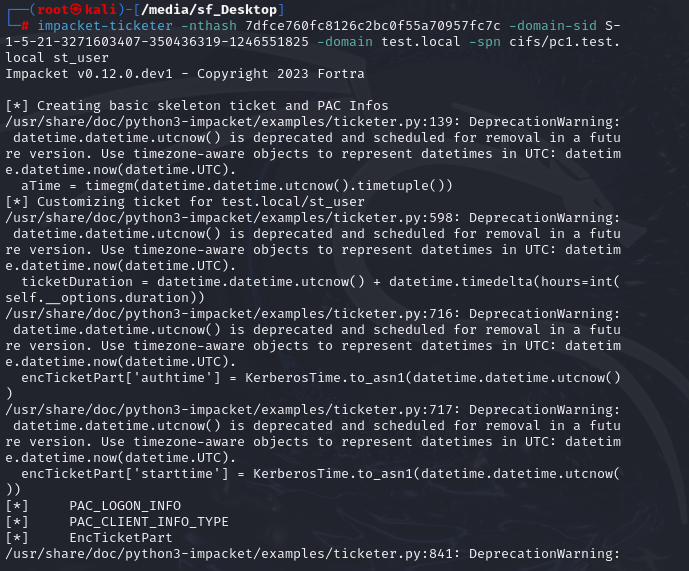

*P.S. для большей скрытности злоумышленники, обычно, используют aes хэш (флаг `-aes`)*

В результате, получили билет, который теперь необходимо заэкспортить:

`export KRB5CCNAME=<TICKET_NAME>.ccache`

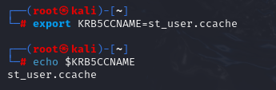

Финальным шагом является применение этого билета посредством Pass The Ticket:

`impacket-psexec <USER>.<DOMAIN> -k -no-pass`
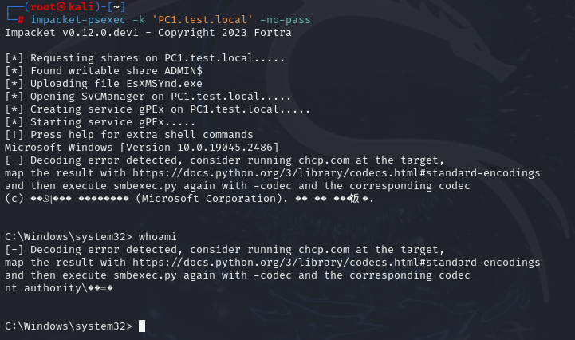
## Локально
Локально атаку провести можно с использованием Rubeus или mimikatz. 
Для начала, проверим доступ к шаре:
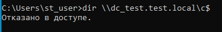

Теперь попробуем выпустить билет для службы cifs (aka smb).

Общий синтаксис команды выпуска билета с помощью mimikatz:

`mimikatz.exe "kerberos::golden /domain:<DOMAIN> /sid:<DOMAIN_SID> /rc4:<HASH> /user:<USER> /service:<SERVICE> /target:<TARGET>"`

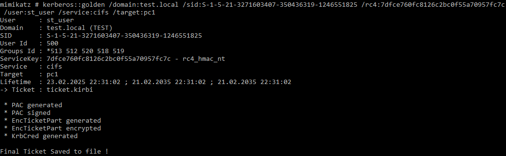

С помощью Rubeus:

`Rubeus.exe silver /service:<SERVICE>/<TARGET>.<DOMAIN> /aes256:<HASH> /sid:<DOMAIN_SID> /user:<USER> /domain:<DOMAIN> /outfile:<FILENAME>.kirbi`

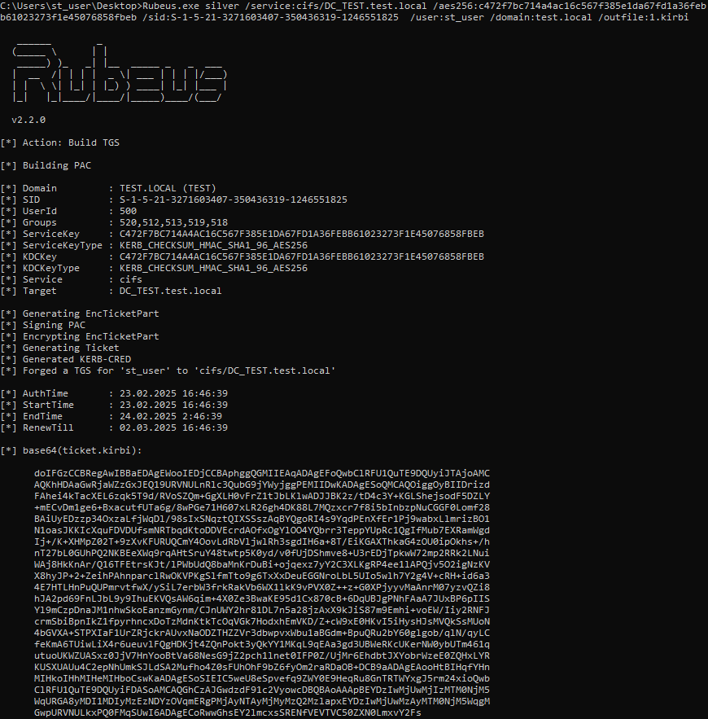

Далее, для разнообразия, проведем конвертацию билета из формата .kirbi в .ccache с помощью ticketConverter:

`impacket-ticketConverter ticket.kirbi ticket.ccache`

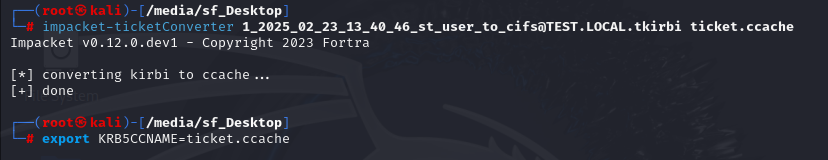

Проверим результат:

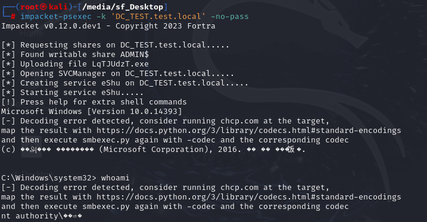
# Артефакты
Основными артефактами успешно проведенной атаки служат:
1. MSIGID 4624: Вход в учетную запись:
При выпущенном Service Ticket событие входа не будет иметь субъекта, однако в блоке "Новый вход" ИД безопасности не будет совпадать с фактическим именем УЗ:
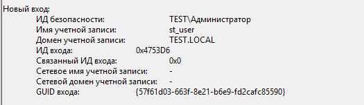

Легитимный вход:

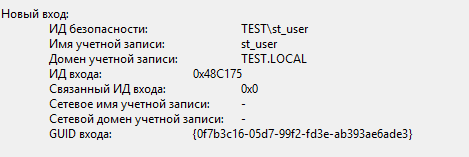

2. MSGID 4634: Выход из учетной записи:
Аналогичным образом ИД безопасности != имени УЗ:

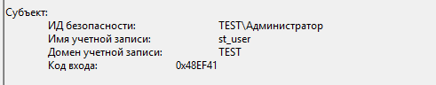

Легитимный выход:

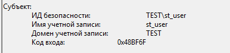

3. 4672: Вход в систему администратора
4. Несоответствие SID пользователя:
Если пользователь при генерации билета приписал себе членство в той или иной группе, это можно отследить с помощью SID:
Легитимный SID:

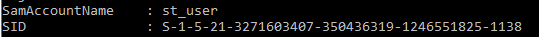

Измененный SID:

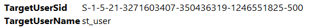
