#### **Описание задания:**

> У открытого окна в кабинете Додсон закурил свою последнюю сигарету на этот день. Вечерело. Фонари медленно загорались, освещая влажную после дождя дорогу. Идиллию прервал громкий хлопок двери. В кабинет влетел Микаел:  
> -Додсон! У нас проблемы!  
> Додсон окинул его уставшим взглядом и безразлично спросил:  
> -Что случилось?  
> Не отдышавшись, Микаел продолжил:  
> -Специалисты центра мониторинга заметили подозрительный туннель на периметре!  
> Глаза Додсона налились кровью:  
> -Нужно немедленно понять, как они это провернули!  
> Микаел вздохнул:  
> -Додсон, этот туннель на твоем компьютере...

#### **Шаг 0. Поиск необходимого актива**

Исходя из диалога сотрудников компании, нам стало известно, что атака произошла на узле Додсона, поэтому необходимо определить название УЗ, хоста и его адрес. Для этого можно перейти в [перечень сервисов](https://cyberbones.standoff365.com/battle/16/article/155) на платформе:

#### **Шаг 1. Ищем точку входа: как заразились?**

Самый сложный этап - найти, с чего всё началось.  Исходя из диалога Додсона и Микаела, нам известно, что специалисты центра мониторинга заметили подозрительный туннель на узле Додсона. Давайте найдём, какая программа его создала.

Для этого, необходимо выполнить поиск сетевой активности (подключения, DNS-запросы и т.д.), которую фиксируют события Sysmon с ID 3, 17, 18 и событие безопасности 5156:

`event_src.host = "COMP-9794.tube.stf" and msgid in [3, 17, 18, 5156]`

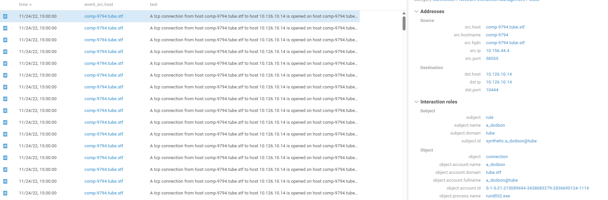

Событий очень много. Чтобы не утонуть в них, сгруппируем результаты по имени процесса - это покажет, какие программы выполняли сетевое взаимодействие.

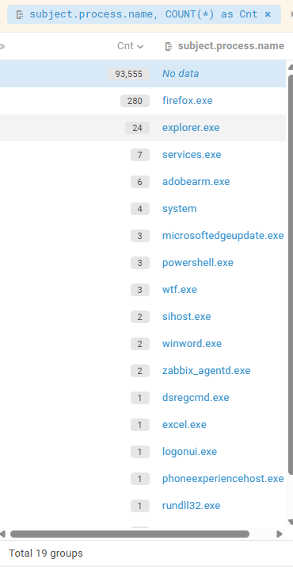

Среди всех процессов выделяются два подозрительных: **winword.exe** и **excel.exe**. Офисные программы не должны создавать постоянные сетевые подключения.

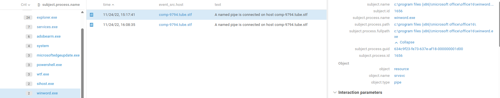
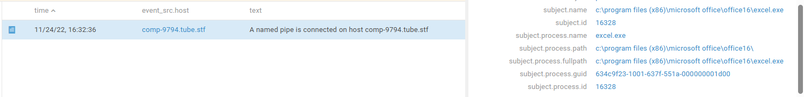
Теперь посмотрим, запуск какого файла привел к инициализации сетевой активности с хостом злоумышленника. Для этого ищем события создания процессов (Sysmon ID 1, 4688) с именами **winword.exe** или **excel.exe**:

`event_src.host = "COMP-9794.tube.stf" and msgid in [1, 4688] and object.process.name in ["winword.exe", "excel.exe"]`

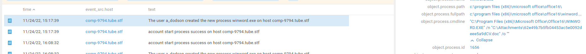

В самых ранних событиях виден запуск Word с документа `CV.doc` из папки `C:\Attachments`. Это классический признак **фишинговой атаки (T1566)** - пользователь открыл вложение из письма.

**Ответ:** C:\Attachments\62e49b7b5fb04453ac5e0092deee5a9dCV.doc

#### **Шаг 2. Что сделал макрос? Ищем первое соединение**

Мы выяснили, что заражение пошло от документа Word. Теперь посмотрим, что происходило сразу после его запуска.

Отфильтруем логи по хосту и процессу `winword.exe`:

`event_src.host = "COMP-9794.tube.stf" AND subject.process.name = "winword.exe"`

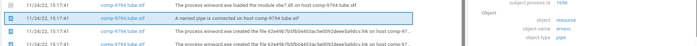

В логах видно, что Word, помимо загрузки легитимных библиотек, подключался к именованному каналу `srvsvc`. Это подозрительно. Осталось разобраться к кому идет подключение:

`event_src.host = "comp-9794.tube.stf" and object.name = "srvsvc"`

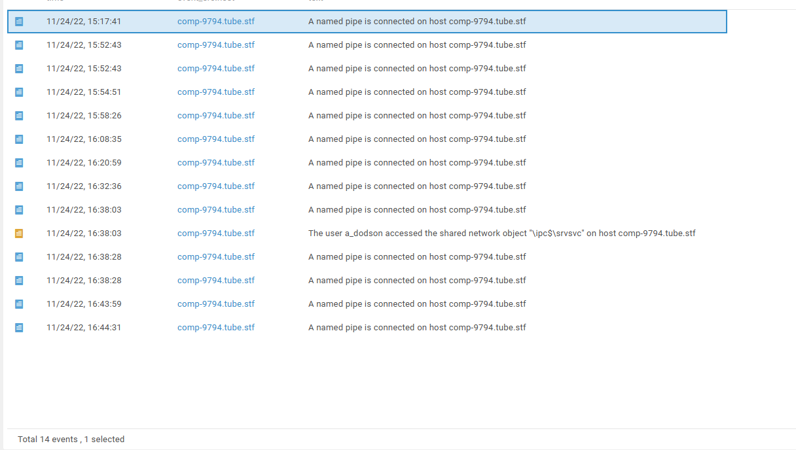

Поиск по названию канала ничего не дал. Попробуем найти прямое сетевое соединение, которое установил процесс `winword.exe` после запуска:

`event_src.host = "comp-9794.tube.stf" and object = "connection" and object.process.name = "winword.exe"`

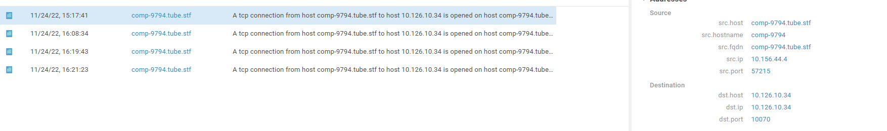

Вредоносный макрос внутри документа прописал команду на подключение к IP-адресу злоумышленника. Это первая связь хоста жертвы с командным сервером.

**Ответ:** 10.126.10.34

#### **Шаг 3. Ищем следы разведки внутри системы**

Злоумышленник внутри системы Додсона (15:17:41). Следуя по матрице MITRE, дальше должно быть инициировано изучение окружения.
На данном этапе, необходимо определить его дальнейшую активность. Для этого можно посмотреть все действия УЗ на узле, связанные с разведкой:

`event_src.host = "comp-9794.tube.stf" and subject.account.name = "a_dodson" and msgid in [4688, 1]`

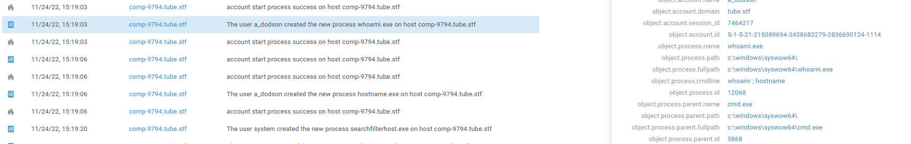

Среди тысяч событий ищем процессы нехарактерные для обычной работы системы, ориентируясь на тактику MITRE **Discovery (TA0007)**.
В результате, удалось определить факт разведки, связанной с попыткой узнать текущее имя пользователя, используя `whoami.exe`.

**Ответ:** c:\windows\syswow64\whoami.exe

#### **Шаг 4. Доставка полезной нагрузки**

Разведка проведена. Дальше злоумышленнику нужен более функциональный инструмент, чем макрос.
Вручную перебирать все события сложно. Воспользуемся "плюшкой" MP SIEM - полем `importance` (важность). Система сама помечает подозрительные события высоким приоритетом:

`event_src.host = "comp-9794.tube.stf" and importance = "high"`

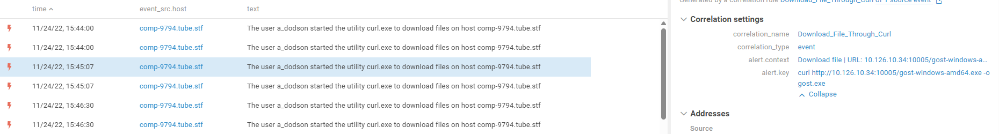

Среди результатов сразу видим событие о загрузке файла `gost-windows-amd64.exe` по HTTP, используя `curl.exe`

Пользуясь уже установленным доступом, злоумышленник вручную или с помощью скрипта скачал на хост основной инструмент - [GOST](https://github.com/ginuerzh/gost/blob/master/README_en.md) для создания туннеля.

**Ответ:** http://10.126.10.34:10005/gost-windows-amd64.exe

#### **Шаг 5. Определяем хэш инструмента**

Исходя из примера [отчета](https://help.standoff365.com/ru-RU/9107435915/portal) расследования, необходимо найти хэш исполняемого файла (в данном случае, для файла gost.exe). Найти его можно, используя функционал Sysmon (событие 1), который позволяет узнать хэш запускаемого файла:

`event_src.host = "comp-9794.tube.stf" and object.name = "gost.exe" and msgid = 1`

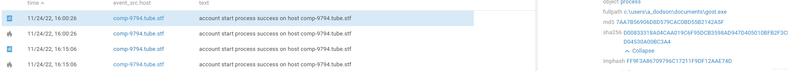

В найденном событии поле `object.process.hash` содержит нужный нам хэш.

**Ответ:** D00833318A04CAA019C6F95DCB3598AD947D405010BFB2F3CBD04530A00BC3A4

#### **Шаг 6. Определяем абсолютной путь инструмента**
Финальный шаг - локализовать вредоносный файл в файловой системе.
Для этого подходит то же самое событие запуска `gost.exe`, которое мы использовали в шаге 5:

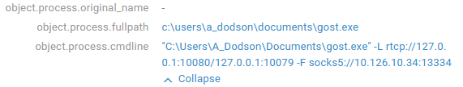

В этом событии есть поле `object.process.fullpath`, которое показывает полный путь к исполняемому файлу.
Вредоносная утилита была сохранена в папку `Documents` пользователя Додсона, откуда и была запущена.

**Ответ:** c:\users\a_dodson\documents\gost.exe

**Итог:** Мы восстановили полную цепочку атаки: **Фишинг -> Запуск макроса -> Установка соединения -> Разведка -> Доставка полезной нагрузки -> Создание туннеля**.
